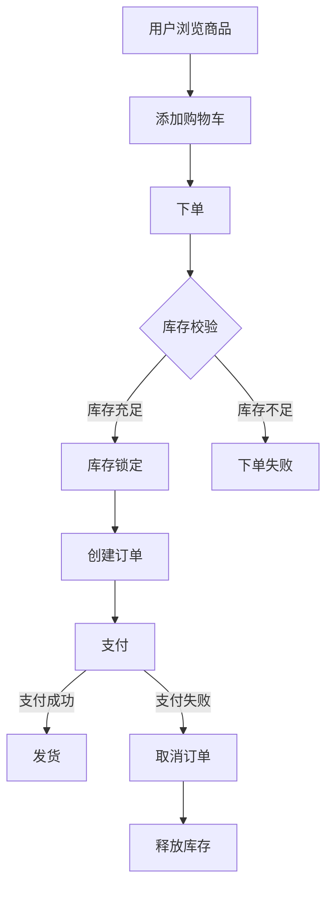
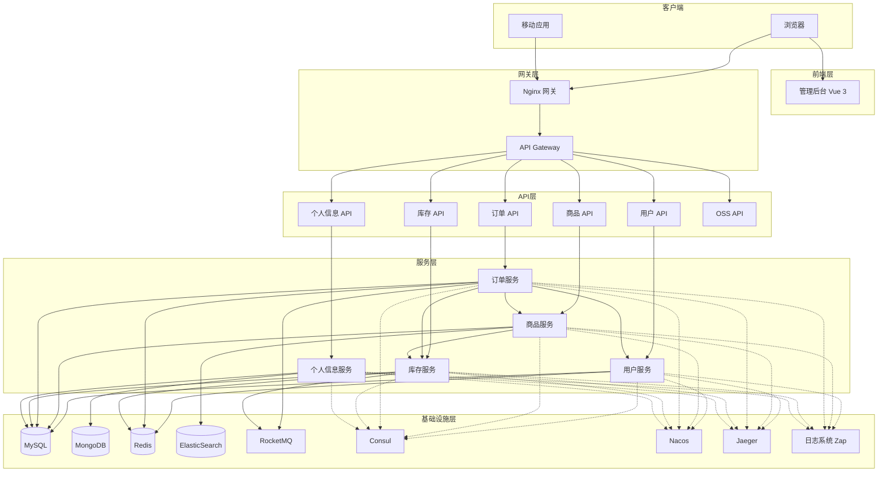
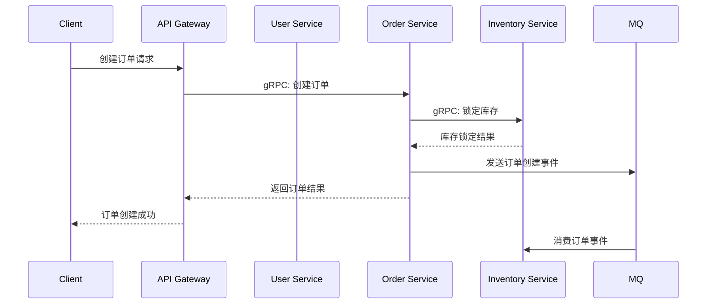
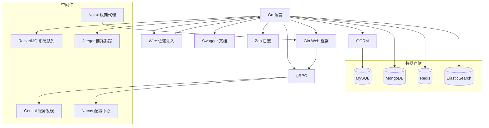

# Shop 电商微服务系统

<p align="center">
  
  
  
  
  
  
  
  
  
  
</p>

<p align="center">
  Shop 是一个基于 Go 语言和微服务架构的完整电商解决方案，采用前后端分离设计，集成了多种现代技术栈与最佳实践。
</p>

## 📑 目录

- [系统概述](#-系统概述)
- [架构设计](#-架构设计)
- [核心功能](#-核心功能)
- [技术栈](#-技术栈)
- [项目结构](#-项目结构)
- [快速开始](#-快速开始)
- [接口文档](#-接口文档)
- [性能测试](#-性能测试)
- [开发指南](#-开发指南)
- [系统文档](#-系统文档)
- [常见问题](#-常见问题)
- [贡献指南](#-贡献指南)
- [许可证](#-许可证)

## 🚀 系统概述

Shop 是一个面向中小型企业的电商系统解决方案，实现了用户、商品、订单、库存和支付等电商核心业务流程。系统基于微服务架构设计，各服务独立部署，确保了系统的高可用性、可扩展性和容错性。

### 业务流程图



## 🏗 架构设计

Shop 采用经典的微服务分层架构，确保了系统的模块化和可维护性。

### 系统架构图



### 分层设计

| 层级         | 职责               | 组件                                                               |
| ------------ | ------------------ | ------------------------------------------------------------------ |
| 网关层       | 请求路由与负载均衡 | Nginx、API Gateway                                                 |
| 基础设施层   | 提供基础服务支持   | MySQL、MongoDB、Redis、ElasticSearch、RocketMQ、Consul、Nacos、Zap |
| 服务层 (SRV) | 实现核心业务逻辑   | 用户服务、商品服务、库存服务、订单服务、个人信息服务               |
| API 层 (Web) | 提供 HTTP 接口     | 用户 API、商品 API、订单 API、库存 API、个人信息 API、OSS 服务     |
| 前端层       | 用户界面展示       | 管理后台 (Vue 3 + Element Plus)                                    |

### 服务通信



## 🔥 核心功能

Shop 实现了电商系统所需的全部核心功能：

### 模块功能对比

| 功能模块 | 主要特性                   | 技术亮点                              |
| -------- | -------------------------- | ------------------------------------- |
| 用户服务 | 注册、登录、鉴权、个人中心 | JWT认证、RBAC权限模型、手机验证码登录 |
| 商品服务 | 商品管理、分类、品牌、属性 | ES全文检索、多级分类、规格管理        |
| 库存服务 | 库存管理、库存锁定/释放    | 分布式锁、乐观并发控制、库存预警      |
| 订单服务 | 购物车、订单管理、支付集成 | 分布式事务、状态机、超时取消          |
| 个人信息 | 收藏、地址管理、消息       | 地址结构化、收藏同步                  |
| OSS服务  | 文件上传、图片处理         | 对象存储、图片压缩、水印              |

## 💻 技术栈

Shop 采用现代化技术栈，兼顾性能与开发效率：

### 后端技术栈



### 后端核心技术详解

| 技术          | 说明                       | 应用场景                             |
| ------------- | -------------------------- | ------------------------------------ |
| Go            | 核心开发语言               | 所有微服务开发                       |
| gRPC          | 高性能RPC框架              | 微服务间通信                         |
| Gin           | HTTP Web框架               | API接口开发                          |
| GORM          | ORM框架                    | 数据库操作                           |
| MySQL         | 关系型数据库               | 核心业务数据存储                     |
| MongoDB       | 文档型数据库               | 日志、用户操作历史等非结构化数据存储 |
| Redis         | 内存数据库                 | 缓存、分布式锁、计数器               |
| ElasticSearch | 全文搜索引擎               | 商品搜索、日志分析                   |
| Consul        | 服务注册与发现             | 服务注册、健康检查、配置共享         |
| Nacos         | 服务发现和配置管理         | 动态配置管理、服务注册               |
| RocketMQ      | 分布式消息队列             | 异步通信、事件驱动、削峰填谷         |
| Nginx         | 高性能HTTP和反向代理服务器 | 负载均衡、静态资源、API网关          |
| Swagger       | API文档工具                | API接口文档生成与测试                |
| Jaeger        | 分布式追踪系统             | 微服务调用链路追踪                   |
| Wire          | 编译期依赖注入             | 依赖管理、代码解耦                   |
| Zap           | 高性能日志库               | 结构化日志记录                       |

## 📁 项目结构

```
shop/
├── docker-compose.yml  # Docker 部署配置
├── Dockerfile          # Docker 构建文件
├── README.md           # 项目说明
├── doc/                # 详细文档
│   ├── interview.md    # 面试指南
│   ├── 用户服务.md      # 用户服务文档
│   ├── 商品服务.md      # 商品服务文档
│   ├── 订单服务.md      # 订单服务文档
│   ├── 库存服务.md      # 库存服务文档
│   ├── 个人信息服务.md   # 个人信息服务文档
│   └── 系统架构与数据流图.md # 系统架构文档
├── backend/            # 后端服务根目录
│   ├── go.mod          # Go模块定义
│   ├── go.sum          # Go依赖版本锁定
│   ├── configs/        # 全局通用配置
│   │   ├── mysql/      # MySQL配置
│   │   ├── redis/      # Redis配置
│   │   ├── consul/     # Consul配置
│   │   ├── nacos/      # Nacos配置
│   │   └── jaeger/     # Jaeger配置
│   ├── pkg/            # 全局共享包
│   │   ├── consul/     # Consul工具
│   │   ├── nacos/      # Nacos工具
│   │   ├── grpc/       # gRPC工具
│   │   ├── client/     # 服务客户端
│   │   ├── logger/     # 日志工具
│   │   ├── database/   # 数据库工具
│   │   ├── middleware/ # 中间件
│   │   ├── auth/       # 认证工具
│   │   ├── jwt/        # JWT工具
│   │   └── util/       # 通用工具函数
│   ├── script/         # 全局脚本
│   │   ├── build.sh    # 构建脚本
│   │   ├── deploy.sh   # 部署脚本
│   │   ├── test.sh     # 测试脚本
│   │   └── mysql/      # 数据库初始化脚本
│   │       ├── user/   # 用户服务SQL脚本
│   │       ├── product/# 商品服务SQL脚本
│   │       ├── inventory/# 库存服务SQL脚本
│   │       └── profile/# 个人信息SQL脚本
│   ├── user/           # 用户服务
│   │   ├── cmd/                # 应用入口
│   │   │   └── main.go         # 服务启动入口
│   │   ├── configs/            # 服务特定配置
│   │   │   ├── config.go       # 配置加载
│   │   │   └── config.yaml     # 配置文件
│   │   ├── api/                # API定义
│   │   │   ├── common/         # 通用定义
│   │   │   └── proto/          # Protocol Buffers
│   │   │       └── user.proto  # 用户服务接口定义
│   │   └── internal/           # 内部实现
│   │       ├── domain/         # 领域模型
│   │       │   ├── entity/     # 实体定义
│   │       │   └── valueobject/ # 值对象
│   │       ├── repository/     # 数据仓储层
│   │       │   ├── user_repository.go   # 仓储接口
│   │       │   ├── user_repository_impl.go # 实现
│   │       │   ├── cache/      # 缓存实现
│   │       │   └── dao/        # 数据访问对象
│   │       ├── service/        # 业务服务层
│   │       │   ├── auth_service.go      # 认证服务接口
│   │       │   ├── auth_service_impl.go # 认证服务实现
│   │       │   ├── user_service.go      # 用户服务接口
│   │       │   └── user_service_impl.go # 用户服务实现
│   │       └── web/            # Web交互层
│   │           ├── grpc/       # gRPC服务实现
│   │           └── http/       # HTTP服务实现
│   ├── product/        # 商品服务（结构类似user服务）
│   ├── order/          # 订单服务（结构类似user服务）
│   ├── inventory/      # 库存服务（结构类似user服务）
│   └── profile/        # 个人信息服务（结构类似user服务）
├── api-gateway/        # API 网关
│   ├── configs/        # 网关配置
│   ├── middleware/     # 网关中间件
│   └── routes/         # 路由定义
└── frontend/           # 前端应用
```

## 🚀 快速开始

### 前置要求

- Docker 和 Docker Compose
- Go 1.16+
- MySQL 8.0+
- MongoDB 4.4+
- Nginx 1.20+
- 其他依赖组件（可通过 Docker Compose 自动部署）

### 使用 Docker Compose 一键部署

```bash
# 克隆仓库
git clone https://github.com/username/shop.git
cd shop

# 启动所有服务
docker-compose up -d
```

### 本地开发环境设置

详细的部署文档请参考 [环境搭建指南](./doc/环境搭建.md)。

## 📝 接口文档

API 文档通过 Swagger UI 提供，启动服务后可访问：

- 用户服务: http://localhost:8021/swagger/index.html
- 商品服务: http://localhost:8022/swagger/index.html
- 订单服务: http://localhost:8023/swagger/index.html
- 个人信息: http://localhost:8024/swagger/index.html

### Swagger 集成

系统使用 swag 工具自动从代码注释生成 Swagger 文档：

```bash
# 安装 swag
go install github.com/swaggo/swag/cmd/swag@latest

# 在服务目录中生成 Swagger 文档
cd backend/user
swag init -g internal/web/router.go
```

## 📊 性能测试

Shop 提供了完整的性能测试工具 (shop_stress)，支持对各微服务进行压力测试：

```bash
cd shop_stress
python stress_test.py -s user -d 30 -c 200 -t 8
```

详细的测试报告和使用方法请参考 [压力测试文档](./shop_stress/README.md)。

### 性能测试结果

| 服务名称 | QPS (1000并发) | 平均响应时间 | P99响应时间 |
| -------- | -------------- | ------------ | ----------- |
| 用户服务 | 5,000+         | < 20ms       | < 50ms      |
| 商品服务 | 3,000+         | < 30ms       | < 70ms      |
| 订单服务 | 2,000+         | < 40ms       | < 90ms      |
| 库存服务 | 4,000+         | < 25ms       | < 60ms      |

## 🔧 开发指南

### 添加新服务

1. 在 shop_srv 目录下创建新的服务目录
2. 编写 proto 文件定义服务接口
3. 生成 gRPC 代码
4. 定义领域接口
5. 实现具体的接口实现类
6. 使用 Wire 配置依赖注入
7. 在 shop_api 目录下创建对应的 API 层
8. 注册到服务发现

### 面向接口编程

Shop 采用面向接口编程的设计理念，主要优势包括：

- **松耦合**：通过接口将系统组件解耦，便于修改和扩展
- **可测试性**：便于编写单元测试，可以轻松模拟依赖项
- **代码复用**：接口允许多种实现方式，提高代码复用性
- **灵活性**：可以轻松替换具体实现，而不影响依赖该接口的代码

详细开发指南请参考 [开发文档](./doc/开发指南.md)。

## 📖 系统文档

Shop 项目提供了详细的系统文档，帮助开发者更好地理解和扩展系统：

### 架构文档

- [系统架构与数据流图](./doc/系统架构与数据流图.md) - 详细的系统组件关系图和数据流转过程
- [架构决策记录(ADR)](./doc/架构决策记录.md) - 记录重要架构决策的原因和影响

### API文档

- [API文档规范](./doc/API文档规范.md) - API开发和文档编写规范，包括Swagger使用指南
- Swagger UI接口文档（启动相应服务后访问）:
  - 用户服务: http://localhost:8021/swagger/index.html
  - 商品服务: http://localhost:8022/swagger/index.html
  - 订单服务: http://localhost:8023/swagger/index.html
  - 个人信息: http://localhost:8024/swagger/index.html

### 微服务文档

- [用户服务](./doc/用户服务.md) - 用户注册、登录、认证等功能
- [商品服务](./doc/商品服务.md) - 商品管理、分类、品牌等功能
- [订单服务](./doc/订单服务.md) - 订单处理、支付集成等
- [库存服务](./doc/库存服务.md) - 库存管理、锁定释放等
- [个人信息服务](./doc/个人信息服务.md) - 用户收藏、地址管理等

### 开发与部署

- [环境搭建](./doc/环境搭建.md) - 开发和生产环境的搭建指南
- [开发者指南](./doc/开发者指南.md) - 详细的代码规范、最佳实践和示例

## ❓ 常见问题

**Q: 如何修改服务配置？**

A: 所有服务配置都存储在 Nacos 配置中心，可以通过 Nacos 控制台 (http://localhost:8848/nacos) 进行修改。

**Q: 如何监控服务状态？**

A: 系统集成了 Jaeger 链路追踪，可以通过 Jaeger UI (http://localhost:16686) 查看服务调用情况。

**Q: 如何进行系统扩展？**

A: 得益于微服务架构，您可以轻松扩展或替换任何服务模块，只需确保遵循现有的接口定义。

更多问题请查阅 [常见问题解答](./doc/FAQ.md)。

## 👥 贡献指南

欢迎为 Shop 做出贡献！无论是提交 bug 报告、功能建议还是代码贡献，我们都非常感谢。

### 如何贡献

1. Fork 本仓库
2. 创建您的特性分支 (`git checkout -b feature/amazing-feature`)
3. 提交您的更改 (`git commit -m 'Add some amazing feature'`)
4. 推送到分支 (`git push origin feature/amazing-feature`)
5. 打开一个 Pull Request

### 代码风格

- Go 代码遵循 [Uber Go Style Guide](https://github.com/uber-go/guide/blob/master/style.md)
- 使用 `gofmt` 格式化代码
- 所有 API 必须有文档注释

## 📄 许可证

该项目采用 MIT 许可证 - 查看 [LICENSE](LICENSE) 文件了解详情。

## 📮 联系我们

- 项目负责人: [dercy](mailto:dercyc@example.com)
- 项目仓库: [GitHub](https://github.com/username/shop)
- 问题反馈: [GitHub Issues](https://github.com/username/shop/issues)
