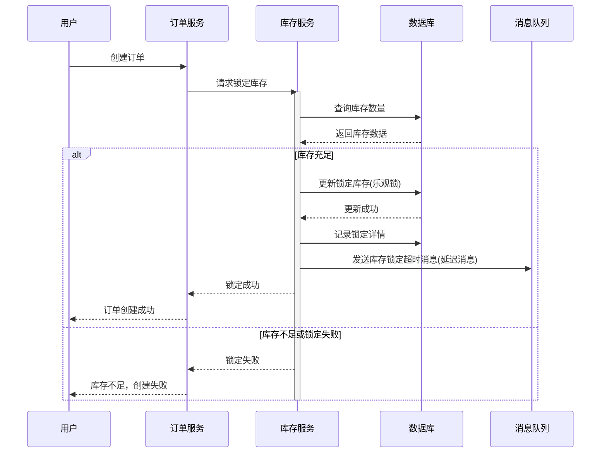
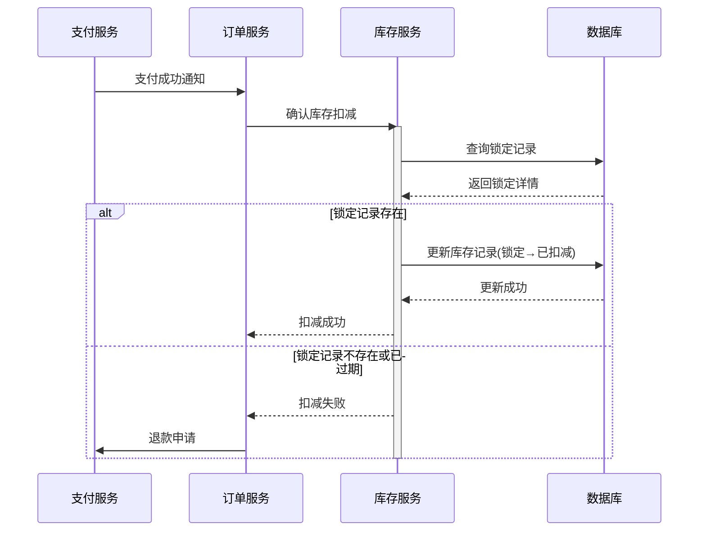
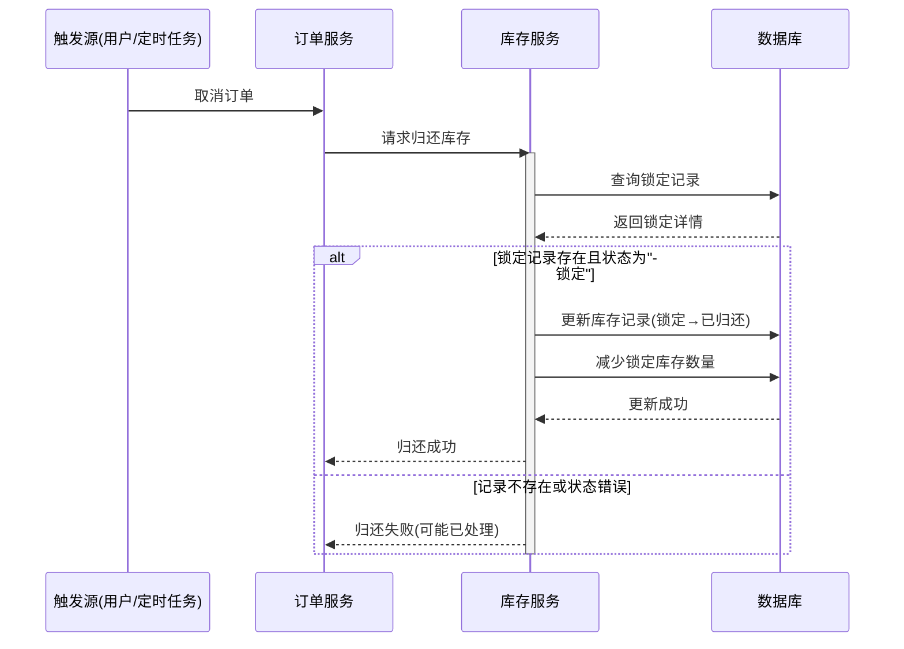
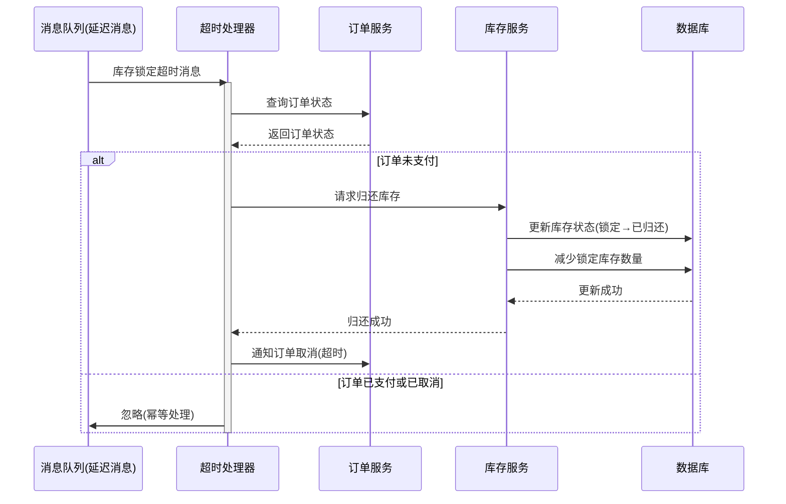
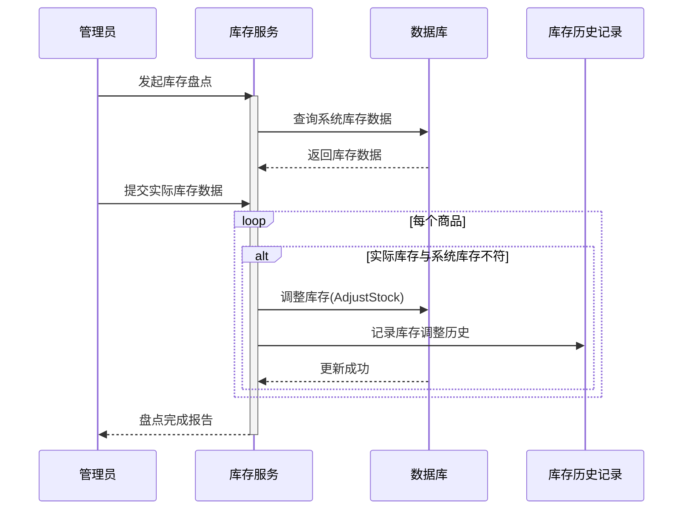

# 库存服务 (Inventory Service)

库存服务是 Shop 电商系统中负责商品库存管理的核心服务，提供库存查询、锁定、扣减和归还等功能，确保商品库存数据的准确性和一致性。

## 目录

1. [功能概述](#1-功能概述)
2. [架构设计](#2-架构设计)
3. [数据模型](#3-数据模型)
4. [API 接口说明](#4-api-接口说明)
5. [业务流程](#5-业务流程)
6. [代码结构](#6-代码结构)
7. [技术栈实现](#7-技术栈实现)
8. [分布式事务](#8-分布式事务)
9. [安全机制](#9-安全机制)
10. [高可用设计](#10-高可用设计)
11. [监控与告警](#11-监控与告警)
12. [gRPC 服务实现](#12-grpc-服务实现)
13. [集成测试与质量保证](#13-集成测试与质量保证)

## 1. 功能概述

库存服务提供以下核心功能：

- **库存查询**：检查商品库存是否充足，支持批量查询和实时查询
- **库存扣减**：下单时扣减商品库存，支持预扣减和最终扣减两阶段操作
- **库存归还**：取消订单或订单超时时归还库存，确保库存数据一致性
- **库存锁定**：在订单创建时锁定库存，防止超卖，支持超时自动释放
- **库存历史记录**：记录库存变更历史，便于追踪和审计
- **库存预警**：商品库存低于阈值时自动触发预警通知
- **仓库管理**：支持多仓库库存管理和调拨
- **库存盘点**：支持周期性库存盘点和异常处理

库存服务作为电商系统的关键服务，需要保证高可用性和数据一致性，采用分布式事务处理机制确保库存操作的原子性和最终一致性。

## 2. 架构设计

库存服务采用领域驱动设计（DDD）和 CQRS（命令查询职责分离）架构，将库存查询操作和库存修改操作分开处理，提高系统性能和可靠性。

### 2.1 系统架构图

```
┌─────────────────────────────────────────────────────────┐
│                   库存服务 (Inventory Service)           │
│                                                         │
│  ┌─────────────┐     ┌─────────────┐     ┌─────────────┐│
│  │  查询API    │     │  命令API    │     │ 库存事件处理 ││
│  │(库存查询等) │     │(扣减/归还等)│     │  (异步处理)  ││
│  └──────┬──────┘     └──────┬──────┘     └──────┬──────┘│
│         │                   │                   │       │
│  ┌──────▼──────┐     ┌──────▼──────┐     ┌──────▼──────┐│
│  │ 读模型缓存  │     │ 库存命令处理 │     │  消息队列   ││
│  │  (Redis)    │     │ (带乐观锁)  │     │ (RocketMQ)  ││
│  └──────┬──────┘     └──────┬──────┘     └──────┬──────┘│
│         │                   │                   │       │
│         └───────────────────▼───────────────────┘       │
│                             │                           │
│                      ┌──────▼──────┐                    │
│                      │   数据存储   │                    │
│                      │   (MySQL)   │                    │
│                      └─────────────┘                    │
└─────────────────────────────────────────────────────────┘
```

### 2.2 设计原则

1. **高并发设计**：采用读写分离、缓存、乐观锁等机制应对高并发场景
2. **数据一致性**：使用分布式事务保证跨服务操作的数据一致性
3. **故障隔离**：采用舱壁模式和熔断器模式，防止故障级联扩散
4. **可扩展性**：水平扩展设计，支持集群部署
5. **可观测性**：全链路追踪、详细日志和监控指标

## 3. 数据模型

库存服务的主要数据模型包括：

### 3.1 库存表 (Inventory)

```sql
CREATE TABLE `inventory` (
  `id` int(11) NOT NULL AUTO_INCREMENT,
  `goods` int(11) NOT NULL COMMENT '商品ID',
  `stocks` int(11) NOT NULL DEFAULT 0 COMMENT '库存数量',
  `version` int(11) NOT NULL DEFAULT 0 COMMENT '乐观锁版本号',
  `warehouse_id` int(11) NOT NULL DEFAULT 1 COMMENT '仓库ID',
  `lock_stocks` int(11) NOT NULL DEFAULT 0 COMMENT '锁定库存数量',
  `alert_threshold` int(11) DEFAULT 10 COMMENT '预警阈值',
  `created_at` datetime(3) DEFAULT NULL,
  `updated_at` datetime(3) DEFAULT NULL,
  `deleted_at` datetime(3) DEFAULT NULL,
  PRIMARY KEY (`id`),
  UNIQUE KEY `idx_goods_warehouse` (`goods`, `warehouse_id`)
) ENGINE=InnoDB DEFAULT CHARSET=utf8mb4;
```

### 3.2 库存记录表 (StockSellDetail)

```sql
CREATE TABLE `stock_sell_detail` (
  `id` int(11) NOT NULL AUTO_INCREMENT,
  `order_sn` varchar(50) NOT NULL COMMENT '订单号',
  `status` int(11) NOT NULL DEFAULT 1 COMMENT '状态：1:锁定，2:已扣减，3:已归还',
  `detail` json DEFAULT NULL COMMENT '库存扣减明细，结构为[{goods_id:1, num:2, warehouse_id:1}]',
  `lock_time` datetime(3) DEFAULT NULL COMMENT '锁定时间',
  `confirm_time` datetime(3) DEFAULT NULL COMMENT '确认时间',
  `created_at` datetime(3) DEFAULT NULL,
  `updated_at` datetime(3) DEFAULT NULL,
  `deleted_at` datetime(3) DEFAULT NULL,
  PRIMARY KEY (`id`),
  UNIQUE KEY `idx_order_sn` (`order_sn`),
  INDEX `idx_status` (`status`),
  INDEX `idx_lock_time` (`lock_time`)
) ENGINE=InnoDB DEFAULT CHARSET=utf8mb4;
```

### 3.3 仓库表 (Warehouse)

```sql
CREATE TABLE `warehouse` (
  `id` int(11) NOT NULL AUTO_INCREMENT,
  `name` varchar(100) NOT NULL COMMENT '仓库名称',
  `address` varchar(255) NOT NULL COMMENT '仓库地址',
  `contact` varchar(50) DEFAULT NULL COMMENT '联系人',
  `phone` varchar(20) DEFAULT NULL COMMENT '联系电话',
  `status` tinyint(1) DEFAULT 1 COMMENT '状态：1-正常，0-禁用',
  `created_at` datetime(3) DEFAULT NULL,
  `updated_at` datetime(3) DEFAULT NULL,
  `deleted_at` datetime(3) DEFAULT NULL,
  PRIMARY KEY (`id`),
  INDEX `idx_status` (`status`)
) ENGINE=InnoDB DEFAULT CHARSET=utf8mb4;
```

### 3.4 库存变更历史表 (InventoryHistory)

```sql
CREATE TABLE `inventory_history` (
  `id` int(11) NOT NULL AUTO_INCREMENT,
  `goods` int(11) NOT NULL COMMENT '商品ID',
  `warehouse_id` int(11) NOT NULL COMMENT '仓库ID',
  `quantity` int(11) NOT NULL COMMENT '变更数量（正数增加，负数减少）',
  `operation_type` varchar(20) NOT NULL COMMENT '操作类型：lock, unlock, decrease, increase, adjust',
  `operator` varchar(50) DEFAULT NULL COMMENT '操作人',
  `order_sn` varchar(50) DEFAULT NULL COMMENT '相关订单号',
  `remark` varchar(255) DEFAULT NULL COMMENT '备注',
  `created_at` datetime(3) DEFAULT NULL,
  PRIMARY KEY (`id`),
  INDEX `idx_goods` (`goods`),
  INDEX `idx_order_sn` (`order_sn`)
) ENGINE=InnoDB DEFAULT CHARSET=utf8mb4;
```

## 4. API 接口说明

库存服务的主要 gRPC 接口包括：

### 4.1 库存管理接口

```protobuf
// 设置商品库存
rpc SetInv(GoodsInvInfo) returns (google.protobuf.Empty);

// 获取商品库存详情
rpc InvDetail(GoodsInvInfo) returns (GoodsInvInfo);

// 批量获取商品库存详情
rpc BatchInvDetail(BatchGoodsInvInfo) returns (BatchGoodsInvInfo);

// 添加库存
rpc AddStock(AddStockInfo) returns (google.protobuf.Empty);

// 调整库存
rpc AdjustStock(AdjustStockInfo) returns (google.protobuf.Empty);
```

### 4.2 库存预定接口

```protobuf
// 锁定商品库存（下单时）
rpc Lock(SellInfo) returns (LockResponse);

// 确认库存扣减（支付成功时）
rpc Sell(SellInfo) returns (google.protobuf.Empty);

// 归还商品库存（订单取消或超时时）
rpc Reback(SellInfo) returns (google.protobuf.Empty);

// 查询预定状态
rpc GetReservationStatus(OrderSn) returns (ReservationStatus);
```

### 4.3 仓库管理接口

```protobuf
// 创建仓库
rpc CreateWarehouse(WarehouseInfo) returns (WarehouseInfo);

// 更新仓库
rpc UpdateWarehouse(WarehouseInfo) returns (google.protobuf.Empty);

// 获取仓库列表
rpc GetWarehouseList(WarehouseQuery) returns (WarehouseListResponse);
```

## 5. 业务流程

库存服务涉及多个关键业务流程，下面详细介绍主要业务场景和实现方案。

### 5.1 下单库存锁定流程

下单时，需要锁定相应商品的库存，防止超卖：



### 5.2 订单支付确认流程

用户支付成功后，需要确认库存扣减：



### 5.3 订单取消归还流程

订单取消或超时未支付时，需要归还库存：



### 5.4 库存锁定超时处理

为防止死锁，系统会自动处理超时未确认的库存锁定：



### 5.5 库存盘点流程

定期进行库存盘点，确保系统库存与实际库存一致：



## 6. 代码结构

库存服务采用整洁架构和领域驱动设计(DDD)原则，代码结构如下：

```
backend/inventory/
├── cmd/                # 应用入口
│   └── main.go         # 服务启动入口
├── configs/            # 服务特定配置
│   ├── config.go       # 配置加载
│   └── config.yaml     # 配置文件
├── api/                # API定义
│   ├── common/         # 通用定义
│   └── proto/          # Protocol Buffers
│       └── inventory.proto # 库存服务接口定义
├── internal/           # 内部实现
│   ├── domain/         # 领域模型
│   │   ├── entity/     # 实体定义
│   │   │   ├── inventory.go   # 库存实体
│   │   │   └── inventory_history.go  # 库存历史实体
│   │   ├── valueobject/ # 值对象
│   │   │   └── stock_operation.go # 库存操作值对象
│   │   └── event/       # 领域事件
│   │       └── inventory_events.go # 库存相关事件
│   ├── repository/     # 数据仓储层
│   │   ├── inventory_repository.go   # 仓储接口
│   │   ├── inventory_repository_impl.go # 实现
│   │   ├── cache/      # 缓存实现
│   │   │   └── redis_cache.go # Redis缓存
│   │   └── dao/        # 数据访问对象
│   │       ├── inventory_dao.go    # 库存DAO
│   │       └── inventory_history_dao.go  # 库存历史DAO
│   ├── service/        # 业务服务层
│   │   ├── inventory_service.go      # 库存服务接口
│   │   ├── inventory_service_impl.go # 库存服务实现
│   │   ├── inventory_lock_service.go # 库存锁定服务接口
│   │   └── inventory_lock_service_impl.go # 库存锁定服务实现
│   └── web/            # Web交互层
│       ├── grpc/       # gRPC服务实现
│       │   └── inventory_grpc_handler.go # gRPC处理器
│       └── http/       # HTTP服务实现
│           └── inventory_handler.go # HTTP处理器
├── pkg/                # 服务内共享包
│   ├── util/           # 通用工具
│   │   └── snowflake.go # 分布式ID生成
│   ├── lock/           # 分布式锁
│   │   └── redis_lock.go # Redis分布式锁
│   └── message/        # 消息队列
│       └── rocketmq.go # RocketMQ客户端
└── script/             # 脚本文件
    └── mysql/          # 数据库脚本
        ├── schema.sql  # 表结构
        └── migrations/ # 数据库迁移
```

## 7. 技术栈实现

库存服务集成了多种现代技术栈，以提供高性能、高可用的库存管理服务：

### 7.1 gRPC 通信

库存服务使用 gRPC 作为微服务间通信的主要方式：

- 使用 Protocol Buffers 定义服务接口，实现强类型、跨语言的服务通信
- 通过拦截器实现统一的日志记录、认证、重试、限流等功能
- 支持双向流通信，便于实现实时库存变更通知
- 高性能的二进制通信协议，降低网络传输开销

```go
// 示例：gRPC 服务器创建与拦截器配置
func createGrpcServer(logger *zap.Logger) *grpc.Server {
    // 创建拦截器链
    interceptors := []grpc.UnaryServerInterceptor{
        // 日志拦截器
        func(ctx context.Context, req interface{}, info *grpc.UnaryServerInfo, handler grpc.UnaryHandler) (interface{}, error) {
            start := time.Now()
            resp, err := handler(ctx, req)

            // 记录调用信息
            logger.Info("gRPC request",
                zap.String("method", info.FullMethod),
                zap.Duration("duration", time.Since(start)),
                zap.Error(err),
            )

            return resp, err
        },

        // 恢复拦截器（处理 panic）
        func(ctx context.Context, req interface{}, info *grpc.UnaryServerInfo, handler grpc.UnaryHandler) (interface{}, error) {
            defer func() {
                if r := recover(); r != nil {
                    logger.Error("Panic recovered in gRPC handler",
                        zap.String("method", info.FullMethod),
                        zap.Any("panic", r),
                        zap.Stack("stack"),
                    )
                }
            }()

            return handler(ctx, req)
        },

        // 限流拦截器
        func(ctx context.Context, req interface{}, info *grpc.UnaryServerInfo, handler grpc.UnaryHandler) (interface{}, error) {
            // 根据不同的方法设置不同的限流策略
            var limiter *rate.Limiter

            switch info.FullMethod {
            case "/inventory.InventoryService/SetInv":
                // 管理员操作，较低频率
                limiter = rate.NewLimiter(rate.Limit(10), 20)
            case "/inventory.InventoryService/InvDetail":
                // 高频查询操作
                limiter = rate.NewLimiter(rate.Limit(1000), 2000)
            case "/inventory.InventoryService/Sell":
                // 订单确认，中等频率
                limiter = rate.NewLimiter(rate.Limit(100), 200)
            default:
                // 默认限流
                limiter = rate.NewLimiter(rate.Limit(50), 100)
            }

            if !limiter.Allow() {
                return nil, status.Errorf(codes.ResourceExhausted, "too many requests")
            }

            return handler(ctx, req)
        },
    }

    // 创建 gRPC 服务器，使用拦截器链
    server := grpc.NewServer(
        grpc.ChainUnaryInterceptor(interceptors...),
    )

    return server
}
```

### 7.2 MongoDB 存储

库存服务使用 MongoDB 存储库存历史记录和分析数据：

- 灵活的文档模型，适合存储结构多变的库存变更历史
- 高性能的写入能力，适合高频的库存操作记录
- 强大的聚合框架，支持复杂的库存数据分析
- 支持时间序列集合，适合存储时间维度的库存变化数据

```go
// 示例：MongoDB 库存历史记录
type InventoryHistoryRepository struct {
    client     *mongo.Client
    database   string
    collection string
    logger     *zap.Logger
}

func NewInventoryHistoryRepository(client *mongo.Client, database, collection string, logger *zap.Logger) *InventoryHistoryRepository {
    return &InventoryHistoryRepository{
        client:     client,
        database:   database,
        collection: collection,
        logger:     logger,
    }
}

// 记录库存变更历史
func (r *InventoryHistoryRepository) RecordInventoryChange(ctx context.Context, record *entity.InventoryChangeRecord) error {
    collection := r.client.Database(r.database).Collection(r.collection)

    doc := bson.M{
        "product_id":    record.ProductID,
        "order_sn":      record.OrderSn,
        "operation":     record.Operation, // lock, unlock, reduce, increase
        "quantity":      record.Quantity,
        "before_stock":  record.BeforeStock,
        "after_stock":   record.AfterStock,
        "operator":      record.Operator,
        "operator_id":   record.OperatorID,
        "reason":        record.Reason,
        "timestamp":     record.Timestamp,
        "success":       record.Success,
        "error_message": record.ErrorMessage,
    }

    _, err := collection.InsertOne(ctx, doc)
    if err != nil {
        r.logger.Error("Failed to insert inventory history",
            zap.Error(err),
            zap.Int64("product_id", record.ProductID),
            zap.String("operation", record.Operation),
        )
        return err
    }

    return nil
}

// 查询商品库存历史
func (r *InventoryHistoryRepository) GetProductInventoryHistory(ctx context.Context, productID int64, startTime, endTime time.Time, page, pageSize int) ([]*entity.InventoryChangeRecord, int64, error) {
    collection := r.client.Database(r.database).Collection(r.collection)

    // 构建查询条件
    filter := bson.M{
        "product_id": productID,
        "timestamp": bson.M{
            "$gte": startTime,
            "$lte": endTime,
        },
    }

    // 计算总数
    total, err := collection.CountDocuments(ctx, filter)
    if err != nil {
        return nil, 0, err
    }

    // 查询历史记录
    opts := options.Find().
        SetSort(bson.M{"timestamp": -1}).
        SetSkip(int64((page - 1) * pageSize)).
        SetLimit(int64(pageSize))

    cursor, err := collection.Find(ctx, filter, opts)
    if err != nil {
        return nil, 0, err
    }
    defer cursor.Close(ctx)

    // 解析结果
    var records []*entity.InventoryChangeRecord
    for cursor.Next(ctx) {
        var doc bson.M
        if err := cursor.Decode(&doc); err != nil {
            r.logger.Error("Failed to decode inventory history", zap.Error(err))
            continue
        }

        record := &entity.InventoryChangeRecord{
            ProductID:    doc["product_id"].(int64),
            OrderSn:      doc["order_sn"].(string),
            Operation:    doc["operation"].(string),
            Quantity:     doc["quantity"].(int32),
            BeforeStock:  doc["before_stock"].(int32),
            AfterStock:   doc["after_stock"].(int32),
            Operator:     doc["operator"].(string),
            OperatorID:   doc["operator_id"].(int64),
            Reason:       doc["reason"].(string),
            Timestamp:    doc["timestamp"].(time.Time),
            Success:      doc["success"].(bool),
        }

        if errorMsg, ok := doc["error_message"].(string); ok {
            record.ErrorMessage = errorMsg
        }

        records = append(records, record)
    }

    return records, total, nil
}

// 聚合库存变更分析数据
func (r *InventoryHistoryRepository) AggregateInventoryChanges(ctx context.Context, startTime, endTime time.Time) ([]*entity.InventoryActivitySummary, error) {
    collection := r.client.Database(r.database).Collection(r.collection)

    pipeline := mongo.Pipeline{
        // 匹配时间范围内的记录
        {{Key: "$match", Value: bson.M{
            "timestamp": bson.M{
                "$gte": startTime,
                "$lte": endTime,
            },
            "success": true,
        }}},
        // 按商品和操作类型分组
        {{Key: "$group", Value: bson.M{
            "_id": bson.M{
                "product_id": "$product_id",
                "operation":  "$operation",
            },
            "count":          bson.M{"$sum": 1},
            "total_quantity": bson.M{"$sum": "$quantity"},
            "max_quantity":   bson.M{"$max": "$quantity"},
            "min_quantity":   bson.M{"$min": "$quantity"},
            "avg_quantity":   bson.M{"$avg": "$quantity"},
        }}},
        // 重新构造结果
        {{Key: "$project", Value: bson.M{
            "_id":            0,
            "product_id":     "$_id.product_id",
            "operation":      "$_id.operation",
            "count":          1,
            "total_quantity": 1,
            "max_quantity":   1,
            "min_quantity":   1,
            "avg_quantity":   1,
        }}},
        // 按商品ID和操作类型排序
        {{Key: "$sort", Value: bson.M{
            "product_id": 1,
            "operation":  1,
        }}},
    }

    cursor, err := collection.Aggregate(ctx, pipeline)
    if err != nil {
        return nil, err
    }
    defer cursor.Close(ctx)

    // 解析结果
    var summaries []*entity.InventoryActivitySummary
    for cursor.Next(ctx) {
        var summary entity.InventoryActivitySummary
        if err := cursor.Decode(&summary); err != nil {
            r.logger.Error("Failed to decode inventory summary", zap.Error(err))
            continue
        }
        summaries = append(summaries, &summary)
    }

    return summaries, nil
}
```

### 7.3 Consul 服务发现

库存服务使用 Consul 实现服务注册与发现：

- 自动注册服务实例，支持多实例负载均衡
- 健康检查确保只有正常运行的实例接收流量
- 使用 Consul KV 存储全局分布式锁和配置
- 支持多数据中心部署，提高服务可用性

```go
// 示例：Consul 服务注册与健康检查
func registerServiceWithConsul(cfg *config.Config, logger *zap.Logger) error {
    // 创建 Consul 客户端
    consulConfig := api.DefaultConfig()
    consulConfig.Address = cfg.Consul.Address

    client, err := api.NewClient(consulConfig)
    if err != nil {
        return fmt.Errorf("create consul client failed: %w", err)
    }

    // 注册服务
    registration := &api.AgentServiceRegistration{
        ID:      fmt.Sprintf("inventory-service-%s-%d", cfg.Server.Host, cfg.Server.Port),
        Name:    "inventory-service",
        Address: cfg.Server.Host,
        Port:    cfg.Server.Port,
        Tags:    []string{"inventory", "stock", "grpc"},
        Meta: map[string]string{
            "version": "1.0.0",
            "env":     cfg.Env,
        },
        Check: &api.AgentServiceCheck{
            GRPC:                           fmt.Sprintf("%s:%d/%s", cfg.Server.Host, cfg.Server.Port, "inventory.InventoryService"),
            Interval:                       "10s",
            Timeout:                        "5s",
            DeregisterCriticalServiceAfter: "30s",
        },
    }

    if err := client.Agent().ServiceRegister(registration); err != nil {
        return fmt.Errorf("register service failed: %w", err)
    }

    logger.Info("Successfully registered service with Consul",
        zap.String("service_id", registration.ID),
        zap.String("address", registration.Address),
        zap.Int("port", registration.Port),
    )

    // 注册关闭钩子，确保服务优雅退出时从 Consul 注销
    c := make(chan os.Signal, 1)
    signal.Notify(c, syscall.SIGINT, syscall.SIGTERM)

    go func() {
        <-c
        logger.Info("Deregistering service from Consul", zap.String("service_id", registration.ID))

        if err := client.Agent().ServiceDeregister(registration.ID); err != nil {
            logger.Error("Failed to deregister service", zap.Error(err))
        }

        os.Exit(0)
    }()

    return nil
}

// 使用 Consul 实现分布式锁
func acquireDistributedLock(client *api.Client, key string, timeout time.Duration) (*api.Lock, error) {
    // 创建分布式锁
    lock, err := client.LockOpts(&api.LockOptions{
        Key:          fmt.Sprintf("locks/inventory/%s", key),
        LockTryOnce:  false,
        LockWaitTime: timeout,
    })
    if err != nil {
        return nil, err
    }

    // 获取锁
    lockCh, err := lock.Lock(nil)
    if err != nil {
        return nil, err
    }

    if lockCh == nil {
        return nil, fmt.Errorf("failed to acquire lock: timeout")
    }

    return lock, nil
}
```

### 7.4 Nacos 配置中心

库存服务使用 Nacos 作为配置中心，实现配置的集中管理：

- 集中管理多环境配置，支持生产、测试、开发环境隔离
- 动态配置更新，无需重启服务
- 配置版本管理和回滚
- 细粒度权限控制，保障配置安全

```go
// 示例：Nacos 配置加载和动态更新
func loadConfigFromNacos(configFilePath string) (*config.Config, error) {
    // 先从本地文件加载基础配置
    var baseConfig config.Config
    if err := loadLocalConfig(configFilePath, &baseConfig); err != nil {
        return nil, err
    }

    // 准备 Nacos 客户端配置
    sc := []constant.ServerConfig{
        {
            IpAddr: baseConfig.Nacos.ServerIP,
            Port:   uint64(baseConfig.Nacos.ServerPort),
        },
    }

    cc := constant.ClientConfig{
        NamespaceId:         baseConfig.Nacos.Namespace,
        TimeoutMs:           5000,
        NotLoadCacheAtStart: true,
        LogDir:              "logs/nacos/log",
        CacheDir:            "logs/nacos/cache",
        LogLevel:            "info",
    }

    // 创建 Nacos 配置客户端
    client, err := clients.CreateConfigClient(map[string]interface{}{
        "serverConfigs": sc,
        "clientConfig":  cc,
    })
    if err != nil {
        return nil, fmt.Errorf("create nacos client failed: %w", err)
    }

    // 从 Nacos 获取完整配置
    content, err := client.GetConfig(vo.ConfigParam{
        DataId: fmt.Sprintf("inventory-service-%s.yaml", baseConfig.Env),
        Group:  baseConfig.Nacos.Group,
    })
    if err != nil {
        return nil, fmt.Errorf("get config from nacos failed: %w", err)
    }

    // 解析配置
    var completeConfig config.Config
    if err := yaml.Unmarshal([]byte(content), &completeConfig); err != nil {
        return nil, fmt.Errorf("unmarshal config failed: %w", err)
    }

    // 注册配置变更监听
    if err := client.ListenConfig(vo.ConfigParam{
        DataId: fmt.Sprintf("inventory-service-%s.yaml", baseConfig.Env),
        Group:  baseConfig.Nacos.Group,
        OnChange: func(namespace, group, dataId, data string) {
            var newConfig config.Config
            if err := yaml.Unmarshal([]byte(data), &newConfig); err != nil {
                log.Printf("Failed to unmarshal updated config: %v", err)
                return
            }

            // 更新运行时配置
            config.UpdateConfig(&newConfig)
            log.Printf("Configuration updated from Nacos: %s", dataId)
        },
    }); err != nil {
        log.Printf("Failed to listen config changes: %v", err)
    }

    return &completeConfig, nil
}

// 本地基础配置加载
func loadLocalConfig(filePath string, cfg *config.Config) error {
    content, err := ioutil.ReadFile(filePath)
    if err != nil {
        return err
    }

    return yaml.Unmarshal(content, cfg)
}
```

### 7.5 Swagger API 文档

库存服务通过 Swagger/OpenAPI 提供 HTTP API 文档：

- 从代码注释自动生成 API 文档
- 提供在线测试和调试接口
- 支持多种开发语言的客户端代码生成
- 方便团队协作和第三方集成

```go
// 示例：Swagger 注解
// @Summary 锁定商品库存
// @Description 为订单锁定商品库存，确保库存充足
// @Tags 库存管理
// @Accept json
// @Produce json
// @Param LockStockRequest body LockStockRequest true "库存锁定请求"
// @Success 200 {object} LockStockResponse
// @Failure 400 {object} ErrorResponse
// @Failure 409 {object} ErrorResponse "库存不足"
// @Failure 500 {object} ErrorResponse
// @Router /api/v1/inventory/lock [post]
func (h *InventoryHandler) LockStock(c *gin.Context) {
    var req LockStockRequest
    if err := c.ShouldBindJSON(&req); err != nil {
        c.JSON(http.StatusBadRequest, ErrorResponse{
            Code:    400,
            Message: "Invalid request: " + err.Error(),
        })
        return
    }

    // 调用库存锁定服务
    result, err := h.inventoryService.LockStock(c.Request.Context(), req.OrderSn, req.Items)
    if err != nil {
        if errors.Is(err, inventory.ErrInsufficientStock) {
            c.JSON(http.StatusConflict, ErrorResponse{
                Code:    409,
                Message: "Insufficient stock: " + err.Error(),
            })
            return
        }

        c.JSON(http.StatusInternalServerError, ErrorResponse{
            Code:    500,
            Message: "Internal error: " + err.Error(),
        })
        return
    }

    c.JSON(http.StatusOK, LockStockResponse{
        Success:   true,
        OrderSn:   req.OrderSn,
        Message:   "Stock locked successfully",
        FailItems: result.FailItems,
    })
}
```

### 7.6 Zap 日志系统

库存服务使用 Zap 实现高性能日志记录：

- 结构化日志格式，便于分析和搜索
- 高性能设计，最小化日志对性能的影响
- 支持多级别日志和采样
- 可配置的日志输出目标，包括文件、标准输出和远程日志系统

```go
// 示例：Zap 日志初始化和使用
func initLogger(cfg *config.Config) (*zap.Logger, error) {
    // 配置日志输出文件
    lumberjackLogger := &lumberjack.Logger{
        Filename:   cfg.Log.Filename,
        MaxSize:    cfg.Log.MaxSize,    // MB
        MaxBackups: cfg.Log.MaxBackups,
        MaxAge:     cfg.Log.MaxAge,     // days
        Compress:   cfg.Log.Compress,
    }

    // 配置日志编码器
    encoderConfig := zapcore.EncoderConfig{
        TimeKey:        "time",
        LevelKey:       "level",
        NameKey:        "logger",
        CallerKey:      "caller",
        FunctionKey:    zapcore.OmitKey,
        MessageKey:     "msg",
        StacktraceKey:  "stacktrace",
        LineEnding:     zapcore.DefaultLineEnding,
        EncodeLevel:    zapcore.LowercaseLevelEncoder,
        EncodeTime:     zapcore.ISO8601TimeEncoder,
        EncodeDuration: zapcore.SecondsDurationEncoder,
        EncodeCaller:   zapcore.ShortCallerEncoder,
    }

    // 配置日志级别
    var level zapcore.Level
    switch strings.ToLower(cfg.Log.Level) {
    case "debug":
        level = zap.DebugLevel
    case "info":
        level = zap.InfoLevel
    case "warn":
        level = zap.WarnLevel
    case "error":
        level = zap.ErrorLevel
    default:
        level = zap.InfoLevel
    }

    // 创建核心配置，支持同时输出到文件和控制台
    core := zapcore.NewCore(
        zapcore.NewJSONEncoder(encoderConfig),
        zapcore.NewMultiWriteSyncer(
            zapcore.AddSync(lumberjackLogger),
            zapcore.AddSync(os.Stdout),
        ),
        zap.NewAtomicLevelAt(level),
    )

    // 创建Logger
    logger := zap.New(core,
        zap.AddCaller(),
        zap.AddCallerSkip(1),
        zap.Fields(
            zap.String("service", "inventory-service"),
            zap.String("version", "1.0.0"),
            zap.String("env", cfg.Env),
        ),
    )

    // 替换全局Logger
    zap.ReplaceGlobals(logger)

    return logger, nil
}

// 库存操作服务示例，使用日志记录关键操作
type InventoryServiceImpl struct {
    repo   repository.InventoryRepository
    logger *zap.Logger
}

func (s *InventoryServiceImpl) LockStock(ctx context.Context, orderSn string, items []*entity.InventoryItem) (*entity.LockResult, error) {
    s.logger.Info("Locking stock for order",
        zap.String("order_sn", orderSn),
        zap.Int("items_count", len(items)),
    )

    // 检查参数
    if len(items) == 0 {
        s.logger.Warn("No items to lock", zap.String("order_sn", orderSn))
        return nil, errors.New("no items to lock")
    }

    // 执行库存锁定
    result, err := s.repo.LockStock(ctx, orderSn, items)

    if err != nil {
        s.logger.Error("Failed to lock stock",
            zap.String("order_sn", orderSn),
            zap.Error(err),
        )
        return nil, err
    }

    // 记录成功日志
    s.logger.Info("Stock locked successfully",
        zap.String("order_sn", orderSn),
        zap.Int("fail_items_count", len(result.FailItems)),
    )

    return result, nil
}
```

## 8. 分布式事务

库存服务使用以下机制处理分布式事务，确保数据一致性：

### 8.1 基于消息队列的异步事务

1. 使用 RocketMQ 作为消息队列
2. 订单创建时，库存服务锁定库存并发送事务消息
3. 如果订单成功，确认消息，正式扣减库存
4. 如果订单失败，取消消息，回滚库存

### 8.2 定时任务检查

1. 定时任务定期扫描长时间处于"锁定"状态的库存记录
2. 对于超过阈值时间（如 30 分钟）仍未确认的记录，主动查询订单状态
3. 根据订单状态决定是否归还库存

### 8.3 乐观锁机制

为防止并发操作导致的数据不一致，库存表使用 version 字段实现乐观锁：

```sql
UPDATE inventory SET stocks = stocks - ?, version = version + 1
WHERE goods = ? AND version = ? AND stocks >= ?
```

### 8.4 消息消费者实现

```go
// internal/message/consumer/inventory_consumer.go 示例
package consumer

import (
    "context"
    "encoding/json"
    "github.com/apache/rocketmq-client-go/v2/consumer"
    "github.com/apache/rocketmq-client-go/v2/primitive"
    "shop/inventory/domain/entity"
    "shop/inventory/domain/service"
    "shop/shared/pkg/logger"
)

// InventoryConsumer 库存消息消费者
type InventoryConsumer struct {
    inventoryService service.InventoryService
    logger           logger.Logger
}

func NewInventoryConsumer(inventoryService service.InventoryService, logger logger.Logger) *InventoryConsumer {
    return &InventoryConsumer{
        inventoryService: inventoryService,
        logger:           logger,
    }
}

// AutoReback 自动归还库存的消费者函数
func (c *InventoryConsumer) AutoReback(ctx context.Context, msgs ...*primitive.MessageExt) (consumer.ConsumeResult, error) {
    for i := range msgs {
        var orderInfo struct {
            OrderSn string `json:"order_sn"`
        }

        err := json.Unmarshal(msgs[i].Body, &orderInfo)
        if err != nil {
            c.logger.Error("解析消息失败", "error", err.Error())
            continue
        }

        // 归还库存
        err = c.inventoryService.ReleaseStockByOrderSn(ctx, orderInfo.OrderSn)
        if err != nil {
            c.logger.Error("归还库存失败", "order_sn", orderInfo.OrderSn, "error", err)
            return consumer.ConsumeRetryLater, nil
        }

        c.logger.Info("归还库存成功", "order_sn", orderInfo.OrderSn)
    }

    return consumer.ConsumeSuccess, nil
}
```

## 9. 安全机制

库存服务采用多种安全机制保护库存数据：

### 9.1 接口安全

- 所有接口都需要进行 JWT 验证
- 管理员操作需要特殊权限
- 库存操作需要记录审计日志
- 关键操作需进行二次确认

### 9.2 并发控制

- 乐观锁防止并发更新问题
- 库存操作的幂等性设计
- 高并发场景下的库存预热和分片策略

### 9.3 数据校验

- 严格校验入参防止恶意请求
- 库存操作设置阈值限制
- 禁止异常的大额库存调整

### 9.4 系统防护

- 接口限流保护服务稳定性
- 熔断机制应对依赖服务故障
- 降级策略应对极端高流量

## 10. 高可用设计

库存服务作为电商系统的核心组件，必须保证高可用性。

### 10.1 多副本部署

- 服务实例至少部署 3 个副本
- 通过 Kubernetes 实现自动扩缩容和故障转移
- 不同副本部署在不同可用区，避免单点故障

### 10.2 读写分离

- 读操作（库存查询）和写操作（库存扣减）通过不同实例处理
- 读操作优先走缓存，减轻数据库压力
- 写操作通过主库进行，确保数据一致性

### 10.3 缓存设计

库存服务采用多层缓存策略：

1. **本地缓存**：服务实例内部维护热点商品库存的本地缓存
2. **分布式缓存**：Redis 集群存储所有商品库存数据
3. **缓存预热**：系统启动或大促前预热热门商品库存缓存
4. **缓存更新**：采用双删策略确保缓存一致性

```go
// 库存缓存更新示例
func (s *stockService) updateStockCache(ctx context.Context, goodsID int, warehouseID int) error {
    // 第一次删除缓存
    cacheKey := fmt.Sprintf("stock:%d:%d", goodsID, warehouseID)
    if err := s.redisClient.Del(ctx, cacheKey).Err(); err != nil {
        s.logger.Error("Failed to delete stock cache", zap.Error(err), zap.Int("goodsID", goodsID))
        // 不阻断主流程
    }

    // 更新数据库
    if err := s.repo.UpdateStock(ctx, goodsID, warehouseID, quantity); err != nil {
        return err
    }

    // 短暂延迟后第二次删除缓存
    go func() {
        time.Sleep(10 * time.Millisecond)
        if err := s.redisClient.Del(context.Background(), cacheKey).Err(); err != nil {
            s.logger.Error("Failed to delete stock cache second time", zap.Error(err), zap.Int("goodsID", goodsID))
        }
    }()

    return nil
}
```

### 10.4 限流与熔断

- 采用令牌桶算法对高频接口进行限流保护
- 实现熔断器模式，防止依赖服务故障导致库存服务不可用
- 降级策略：熔断时提供有限服务（如只读模式）

### 10.5 幂等性设计

所有库存操作实现幂等性设计，确保重复请求不会导致错误结果：

1. **唯一标识**：基于订单号等业务 ID 生成操作唯一标识
2. **状态记录**：记录每个操作的执行状态
3. **结果校验**：重复请求时返回之前的执行结果

```go
// 库存锁定幂等实现示例
func (s *stockService) LockStock(ctx context.Context, req *proto.SellInfo) (*proto.LockResponse, error) {
    // 检查是否已存在相同订单的库存锁定记录
    detail, err := s.repo.GetStockSellDetailByOrderSn(ctx, req.OrderSn)
    if err == nil && detail != nil {
        // 已经处理过的请求，返回之前的结果
        return &proto.LockResponse{
            Success: detail.Status == models.StockLocked,
        }, nil
    }

    // 继续处理新的库存锁定请求
    // ...
}
```

## 11. 监控与告警

完善的监控体系是保障库存服务稳定运行的关键。

### 11.1 关键指标监控

- **系统指标**：CPU、内存、磁盘、网络
- **应用指标**：请求量、错误率、响应时间
- **业务指标**：库存锁定次数、库存不足次数、热点商品访问量

### 11.2 日志管理

- 采用结构化日志格式，便于分析和检索
- 关键操作记录详细日志，包括请求参数和处理结果
- 敏感操作记录操作人和完整上下文

### 11.3 告警策略

- **库存预警**：商品库存低于阈值时触发告警
- **错误率告警**：服务错误率超过阈值时告警
- **响应时间告警**：接口响应时间异常时告警
- **数据不一致告警**：检测到缓存与数据库库存不一致时告警

### 11.4 链路追踪

- 基于 Jaeger 实现全链路追踪
- 记录库存操作在各个微服务间的传递过程
- 支持根据订单号等业务 ID 查询完整处理链路

## 12. gRPC 服务实现

库存服务通过 gRPC 提供高性能的库存操作接口，支持订单服务等其他微服务进行库存查询和操作。

### 12.1 Protocol Buffers 定义

```protobuf
// api/proto/inventory/inventory.proto
syntax = "proto3";

package inventory;

option go_package = "shop/inventory/api/proto/inventory";

import "google/protobuf/empty.proto";
import "google/protobuf/timestamp.proto";

// 库存服务定义
service InventoryService {
  // 库存查询相关
  rpc GetInventory(GetInventoryRequest) returns (InventoryResponse) {}
  rpc BatchGetInventory(BatchGetInventoryRequest) returns (BatchInventoryResponse) {}

  // 库存操作相关
  rpc SetInventory(SetInventoryRequest) returns (InventoryResponse) {}
  rpc AddInventory(InventoryOperationRequest) returns (InventoryResponse) {}
  rpc ReduceInventory(InventoryOperationRequest) returns (InventoryResponse) {}

  // 库存锁定和处理
  rpc LockInventory(LockInventoryRequest) returns (LockInventoryResponse) {}
  rpc UnlockInventory(UnlockInventoryRequest) returns (google.protobuf.Empty) {}
  rpc ConfirmInventoryReduce(ConfirmReduceRequest) returns (google.protobuf.Empty) {}

  // 库存历史相关
  rpc GetInventoryHistory(GetInventoryHistoryRequest) returns (InventoryHistoryListResponse) {}
}

// 获取库存请求
message GetInventoryRequest {
  int64 product_id = 1;
}

// 库存响应
message InventoryResponse {
  int64 product_id = 1;
  int32 stock = 2;
  int32 locked = 3;
  int32 available = 4;
  google.protobuf.Timestamp updated_at = 5;
}

// 批量获取库存请求
message BatchGetInventoryRequest {
  repeated int64 product_ids = 1;
}

// 批量库存响应
message BatchInventoryResponse {
  repeated InventoryResponse inventories = 1;
}

// 设置库存请求
message SetInventoryRequest {
  int64 product_id = 1;
  int32 stock = 2;
  string operator = 3;
}

// 库存操作请求
message InventoryOperationRequest {
  int64 product_id = 1;
  int32 quantity = 2;
  string operator = 3;
  string remark = 4;
}

// 锁定库存请求
message LockInventoryRequest {
  string lock_key = 1;  // 订单号或其他唯一标识
  repeated LockItem items = 2;
  int32 timeout_seconds = 3;  // 锁定超时时间
}

// 锁定项
message LockItem {
  int64 product_id = 1;
  int32 quantity = 2;
}

// 锁定库存响应
message LockInventoryResponse {
  bool success = 1;
  string message = 2;
  repeated LockFailItem fail_items = 3;  // 锁定失败的项目
}

// 锁定失败项
message LockFailItem {
  int64 product_id = 1;
  int32 quantity = 2;
  int32 available = 3;
  string reason = 4;
}

// 解锁库存请求
message UnlockInventoryRequest {
  string lock_key = 1;
}

// 确认库存扣减请求
message ConfirmReduceRequest {
  string lock_key = 1;
}

// 获取库存历史请求
message GetInventoryHistoryRequest {
  int64 product_id = 1;
  int32 page = 2;
  int32 page_size = 3;
  google.protobuf.Timestamp start_time = 4;
  google.protobuf.Timestamp end_time = 5;
}

// 库存历史记录
message InventoryHistoryResponse {
  int64 id = 1;
  int64 product_id = 2;
  int32 quantity = 3;
  int32 stock_before = 4;
  int32 stock_after = 5;
  string operation_type = 6;  // ADD, REDUCE, LOCK, UNLOCK
  string operator = 7;
  string remark = 8;
  google.protobuf.Timestamp created_at = 9;
}

// 库存历史列表响应
message InventoryHistoryListResponse {
  int32 total = 1;
  repeated InventoryHistoryResponse history = 2;
}
```

### 12.2 gRPC 服务器实现

```go
// internal/web/grpc/handler.go
package grpc

import (
    "context"

    "google.golang.org/grpc/codes"
    "google.golang.org/grpc/status"
    "google.golang.org/protobuf/types/known/emptypb"
    "google.golang.org/protobuf/types/known/timestamppb"

    "shop/inventory/api/proto/inventory"
    "shop/inventory/internal/service"
)

// InventoryServiceServer 实现 gRPC 库存服务
type InventoryServiceServer struct {
    inventoryService service.InventoryService
    lockService      service.InventoryLockService
    inventory.UnimplementedInventoryServiceServer
}

// NewInventoryServiceServer 创建库存服务 gRPC 服务器
func NewInventoryServiceServer(
    inventoryService service.InventoryService,
    lockService service.InventoryLockService,
) *InventoryServiceServer {
    return &InventoryServiceServer{
        inventoryService: inventoryService,
        lockService:      lockService,
    }
}

// GetInventory 获取商品库存
func (s *InventoryServiceServer) GetInventory(ctx context.Context, req *inventory.GetInventoryRequest) (*inventory.InventoryResponse, error) {
    inv, err := s.inventoryService.GetInventory(ctx, req.ProductId)
    if err != nil {
        return nil, status.Errorf(codes.NotFound, "inventory not found: %v", err)
    }

    return &inventory.InventoryResponse{
        ProductId: inv.ProductID,
        Stock:     int32(inv.Stock),
        Locked:    int32(inv.Locked),
        Available: int32(inv.Stock - inv.Locked),
        UpdatedAt: timestamppb.New(inv.UpdatedAt),
    }, nil
}

// BatchGetInventory 批量获取商品库存
func (s *InventoryServiceServer) BatchGetInventory(ctx context.Context, req *inventory.BatchGetInventoryRequest) (*inventory.BatchInventoryResponse, error) {
    invList, err := s.inventoryService.BatchGetInventory(ctx, req.ProductIds)
    if err != nil {
        return nil, status.Errorf(codes.Internal, "failed to get inventories: %v", err)
    }

    inventories := make([]*inventory.InventoryResponse, 0, len(invList))
    for _, inv := range invList {
        inventories = append(inventories, &inventory.InventoryResponse{
            ProductId: inv.ProductID,
            Stock:     int32(inv.Stock),
            Locked:    int32(inv.Locked),
            Available: int32(inv.Stock - inv.Locked),
            UpdatedAt: timestamppb.New(inv.UpdatedAt),
        })
    }

    return &inventory.BatchInventoryResponse{
        Inventories: inventories,
    }, nil
}

// LockInventory 锁定库存
func (s *InventoryServiceServer) LockInventory(ctx context.Context, req *inventory.LockInventoryRequest) (*inventory.LockInventoryResponse, error) {
    // 转换为领域模型
    items := make([]service.LockItem, 0, len(req.Items))
    for _, item := range req.Items {
        items = append(items, service.LockItem{
            ProductID: item.ProductId,
            Quantity:  int(item.Quantity),
        })
    }

    // 锁定库存
    result, err := s.lockService.LockInventory(ctx, req.LockKey, items, int(req.TimeoutSeconds))
    if err != nil {
        return nil, status.Errorf(codes.Internal, "failed to lock inventory: %v", err)
    }

    // 检查锁定结果
    if !result.Success {
        return &inventory.LockInventoryResponse{
            Success: false,
            Message: result.Message,
            FailItems: result.FailItems,
        }, nil
    }

    return &inventory.LockInventoryResponse{
        Success: true,
        Message: "库存锁定成功",
    }, nil
}

// UnlockInventory 解锁库存
func (s *InventoryServiceServer) UnlockInventory(ctx context.Context, req *inventory.UnlockInventoryRequest) (*emptypb.Empty, error) {
    err := s.lockService.UnlockInventory(ctx, req.LockKey)
    if err != nil {
        return nil, status.Errorf(codes.Internal, "failed to unlock inventory: %v", err)
    }

    return &emptypb.Empty{}, nil
}

// ConfirmInventoryReduce 确认扣减库存
func (s *InventoryServiceServer) ConfirmInventoryReduce(ctx context.Context, req *inventory.ConfirmReduceRequest) (*emptypb.Empty, error) {
    err := s.lockService.ConfirmReduce(ctx, req.LockKey)
    if err != nil {
        return nil, status.Errorf(codes.Internal, "failed to confirm inventory reduction: %v", err)
    }

    return &emptypb.Empty{}, nil
}

// 其他方法实现...
```

### 12.3 gRPC 服务器启动

```go
// internal/web/grpc/server.go
package grpc

import (
    "net"

    "google.golang.org/grpc"
    "google.golang.org/grpc/credentials"

    "shop/inventory/api/proto/inventory"
    "shop/inventory/internal/service"
    "shop/inventory/pkg/grpc/server"
)

// StartGRPCServer 启动 gRPC 服务器
func StartGRPCServer(
    inventoryService service.InventoryService,
    lockService service.InventoryLockService,
    port string,
    certFile, keyFile string,
) error {
    addr := ":" + port

    var opts []grpc.ServerOption

    // 如果提供了证书文件，启用 TLS
    if certFile != "" && keyFile != "" {
        creds, err := credentials.NewServerTLSFromFile(certFile, keyFile)
        if err != nil {
            return err
        }
        opts = append(opts, grpc.WithTransportCredentials(creds))
    } else {
        opts = append(opts, grpc.WithTransportCredentials(insecure.NewCredentials()))
    }

    // 添加拦截器
    opts = append(opts,
        grpc.UnaryInterceptor(server.LoggingInterceptor),
        grpc.ChainUnaryInterceptor(
            server.RecoveryInterceptor,
            server.RateLimitInterceptor,
        ),
    )

    // 创建 gRPC 服务器
    grpcServer := grpc.NewServer(opts...)

    // 注册服务
    inventoryServer := NewInventoryServiceServer(
        inventoryService,
        lockService,
    )
    inventory.RegisterInventoryServiceServer(grpcServer, inventoryServer)

    // 启动服务器
    lis, err := net.Listen("tcp", addr)
    if err != nil {
        return err
    }

    return grpcServer.Serve(lis)
}
```

### 12.4 gRPC 客户端实现

```go
// api/client/inventory_client.go
package client

import (
    "context"
    "time"

    "google.golang.org/grpc"
    "google.golang.org/grpc/credentials"
    "google.golang.org/grpc/credentials/insecure"

    "shop/inventory/api/proto/inventory"
    "shop/inventory/pkg/grpc/client"
)

// InventoryClient 库存服务客户端
type InventoryClient struct {
    conn   *grpc.ClientConn
    client inventory.InventoryServiceClient
}

// NewInventoryClient 创建库存服务客户端
func NewInventoryClient(target string, useTLS bool, certFile string, timeout time.Duration) (*InventoryClient, error) {
    var opts []grpc.DialOption

    // 设置连接超时
    ctx, cancel := context.WithTimeout(context.Background(), timeout)
    defer cancel()

    // 配置认证
    if useTLS {
        creds, err := credentials.NewClientTLSFromFile(certFile, "")
        if err != nil {
            return nil, err
        }
        opts = append(opts, grpc.WithTransportCredentials(creds))
    } else {
        opts = append(opts, grpc.WithTransportCredentials(insecure.NewCredentials()))
    }

    // 添加拦截器
    opts = append(opts,
        grpc.WithUnaryInterceptor(client.LoggingInterceptor),
        grpc.WithChainUnaryInterceptor(
            client.RetryInterceptor,
            client.TimeoutInterceptor,
        ),
    )

    // 创建连接
    conn, err := grpc.DialContext(ctx, target, opts...)
    if err != nil {
        return nil, err
    }

    // 创建客户端
    client := inventory.NewInventoryServiceClient(conn)

    return &InventoryClient{
        conn:   conn,
        client: client,
    }, nil
}

// Close 关闭连接
func (c *InventoryClient) Close() error {
    return c.conn.Close()
}

// GetInventory 获取商品库存
func (c *InventoryClient) GetInventory(ctx context.Context, productID int64) (*inventory.InventoryResponse, error) {
    return c.client.GetInventory(ctx, &inventory.GetInventoryRequest{
        ProductId: productID,
    })
}

// BatchGetInventory 批量获取商品库存
func (c *InventoryClient) BatchGetInventory(ctx context.Context, productIDs []int64) ([]*inventory.InventoryResponse, error) {
    resp, err := c.client.BatchGetInventory(ctx, &inventory.BatchGetInventoryRequest{
        ProductIds: productIDs,
    })
    if err != nil {
        return nil, err
    }
    return resp.Inventories, nil
}

// LockInventory 锁定库存
func (c *InventoryClient) LockInventory(ctx context.Context, lockKey string, items []LockItem, timeoutSeconds int) (*inventory.LockInventoryResponse, error) {
    lockItems := make([]*inventory.LockItem, 0, len(items))
    for _, item := range items {
        lockItems = append(lockItems, &inventory.LockItem{
            ProductId: item.ProductID,
            Quantity:  int32(item.Quantity),
        })
    }

    return c.client.LockInventory(ctx, &inventory.LockInventoryRequest{
        LockKey:        lockKey,
        Items:          lockItems,
        TimeoutSeconds: int32(timeoutSeconds),
    })
}

// LockItem 锁定项
type LockItem struct {
    ProductID int64
    Quantity  int
}

// 其他方法实现...
```

## 13. 集成测试与质量保证

库存服务作为电商系统中的关键基础服务，需要严格的测试策略来确保其在各种场景下的正确性和稳定性。

### 13.1 测试策略概述

库存服务的测试策略遵循测试金字塔模型，包含单元测试、集成测试和端到端测试：

```
          ╱╲
         /E2E\       少量端到端测试
        /────────\
       /          \
      / Integration \   适量集成测试
     /──────────────────\
    /                    \
   /      Unit Tests      \  大量单元测试
  ╱─────────────────────────╲
```

1. **单元测试**：

   - 覆盖所有业务逻辑和领域模型
   - 使用模拟外部依赖进行孤立测试
   - 确保代码逻辑正确性

2. **集成测试**：

   - 验证与其他服务的交互
   - 测试数据持久化和事务处理
   - 确保功能在集成环境中正常工作

3. **端到端测试**：
   - 模拟真实用户场景的完整业务流程
   - 验证多个服务协同工作的正确性
   - 发现集成环境中的边界问题

### 13.2 库存服务集成测试重点

库存服务的集成测试重点关注以下方面：

#### 13.2.1 库存操作一致性测试

验证库存操作在各种场景下的数据一致性：

```go
func TestInventoryConsistency(t *testing.T) {
    // 设置测试环境
    ctx := context.Background()
    client := setupGrpcClient(t)

    // 准备测试数据
    productID := prepareTestProduct(t)
    initialStock := 100

    // 设置初始库存
    _, err := client.SetStock(ctx, &proto.SetStockRequest{
        ProductId: productID,
        Count:     int32(initialStock),
    })
    require.NoError(t, err)

    // 并发执行扣减库存操作
    var wg sync.WaitGroup
    decrementCount := 10
    threadCount := 5
    errors := make([]error, threadCount)

    for i := 0; i < threadCount; i++ {
        wg.Add(1)
        go func(index int) {
            defer wg.Done()
            _, err := client.DecrementStock(ctx, &proto.DecrementStockRequest{
                ProductId: productID,
                Count:     int32(decrementCount),
            })
            errors[index] = err
        }(i)
    }

    wg.Wait()

    // 验证操作结果
    for i, err := range errors {
        require.NoError(t, err, "Thread %d failed", i)
    }

    // 验证最终库存状态
    resp, err := client.GetStock(ctx, &proto.GetStockRequest{
        ProductId: productID,
    })
    require.NoError(t, err)
    assert.Equal(t, initialStock - (decrementCount * threadCount), int(resp.Stock))
}
```

#### 13.2.2 跨服务协调测试

测试库存服务与订单服务的协调工作：

```go
func TestOrderInventoryCoordination(t *testing.T) {
    // 设置测试环境
    ctx := context.Background()
    invClient := setupInventoryClient(t)
    orderClient := setupOrderClient(t)

    // 准备测试数据
    productID := prepareTestProduct(t)
    userID := prepareTestUser(t)
    initialStock := 20
    orderQuantity := 5

    // 设置初始库存
    _, err := invClient.SetStock(ctx, &proto.SetStockRequest{
        ProductId: productID,
        Count:     int32(initialStock),
    })
    require.NoError(t, err)

    // 创建订单
    orderResp, err := orderClient.CreateOrder(ctx, &orderproto.CreateOrderRequest{
        UserId: userID,
        Items: []*orderproto.OrderItem{
            {
                ProductId: productID,
                Count:     int32(orderQuantity),
            },
        },
    })
    require.NoError(t, err)
    require.NotEmpty(t, orderResp.OrderId)

    // 验证库存被锁定
    stockResp, err := invClient.GetStock(ctx, &proto.GetStockRequest{
        ProductId: productID,
    })
    require.NoError(t, err)
    assert.Equal(t, initialStock-orderQuantity, int(stockResp.Available))
    assert.Equal(t, orderQuantity, int(stockResp.Locked))

    // 模拟订单支付成功
    _, err = orderClient.PayOrder(ctx, &orderproto.PayOrderRequest{
        OrderId: orderResp.OrderId,
    })
    require.NoError(t, err)

    // 验证锁定库存被实际扣减
    stockResp, err = invClient.GetStock(ctx, &proto.GetStockRequest{
        ProductId: productID,
    })
    require.NoError(t, err)
    assert.Equal(t, initialStock-orderQuantity, int(stockResp.Total))
    assert.Equal(t, initialStock-orderQuantity, int(stockResp.Available))
    assert.Equal(t, 0, int(stockResp.Locked))
}
```

#### 13.2.3 消息事件处理测试

测试基于消息队列的异步事件处理：

```go
func TestInventoryEventHandling(t *testing.T) {
    // 设置测试环境
    mqProducer := setupMQProducer(t)
    inventoryClient := setupInventoryClient(t)

    // 准备测试数据
    productID := prepareTestProduct(t)
    initialStock := 50
    lockQuantity := 10

    // 设置初始库存
    _, err := inventoryClient.SetStock(context.Background(), &proto.SetStockRequest{
        ProductId: productID,
        Count:     int32(initialStock),
    })
    require.NoError(t, err)

    // 发送库存锁定事件
    lockEvent := InventoryLockEvent{
        ProductID: productID,
        Quantity:  lockQuantity,
        OrderID:   "test-order-123",
        EventID:   uuid.New().String(),
    }
    err = mqProducer.SendMessage("inventory_lock", lockEvent)
    require.NoError(t, err)

    // 等待事件处理完成
    time.Sleep(2 * time.Second)

    // 验证库存锁定结果
    resp, err := inventoryClient.GetStock(context.Background(), &proto.GetStockRequest{
        ProductId: productID,
    })
    require.NoError(t, err)
    assert.Equal(t, initialStock, int(resp.Total))
    assert.Equal(t, initialStock-lockQuantity, int(resp.Available))
    assert.Equal(t, lockQuantity, int(resp.Locked))

    // 发送库存释放事件
    releaseEvent := InventoryReleaseEvent{
        ProductID: productID,
        Quantity:  lockQuantity,
        OrderID:   "test-order-123",
        EventID:   uuid.New().String(),
    }
    err = mqProducer.SendMessage("inventory_release", releaseEvent)
    require.NoError(t, err)

    // 等待事件处理完成
    time.Sleep(2 * time.Second)

    // 验证库存释放结果
    resp, err = inventoryClient.GetStock(context.Background(), &proto.GetStockRequest{
        ProductId: productID,
    })
    require.NoError(t, err)
    assert.Equal(t, initialStock, int(resp.Total))
    assert.Equal(t, initialStock, int(resp.Available))
    assert.Equal(t, 0, int(resp.Locked))
}
```

#### 13.2.4 分布式事务恢复测试

测试服务崩溃后的事务恢复机制：

```go
func TestTransactionRecovery(t *testing.T) {
    // 设置测试环境
    ctx := context.Background()
    client := setupInventoryClient(t)

    // 准备测试数据
    productID := prepareTestProduct(t)
    initialStock := 30
    lockQuantity := 10

    // 设置初始库存
    _, err := client.SetStock(ctx, &proto.SetStockRequest{
        ProductId: productID,
        Count:     int32(initialStock),
    })
    require.NoError(t, err)

    // 执行库存锁定
    resp, err := client.LockStock(ctx, &proto.LockStockRequest{
        ProductId: productID,
        Count:     int32(lockQuantity),
        OrderId:   "recovery-test-order",
    })
    require.NoError(t, err)
    require.True(t, resp.Success)

    // 验证锁定成功
    stockResp, err := client.GetStock(ctx, &proto.GetStockRequest{
        ProductId: productID,
    })
    require.NoError(t, err)
    assert.Equal(t, lockQuantity, int(stockResp.Locked))

    // 模拟服务崩溃和重启
    simulateServiceRestart(t)

    // 等待恢复流程完成
    time.Sleep(5 * time.Second)

    // 验证未完成事务被正确恢复
    stockResp, err = client.GetStock(ctx, &proto.GetStockRequest{
        ProductId: productID,
    })
    require.NoError(t, err)
    assert.Equal(t, lockQuantity, int(stockResp.Locked), "锁定的库存应该在服务重启后保持")
}
```

### 13.3 测试环境管理

库存服务采用容器化测试环境，确保测试的一致性和可重复性：

1. **测试容器编排**：
   - 使用 Docker Compose 创建隔离的测试环境
   - 自动化数据库初始化和服务配置
   - 支持并行运行多个测试实例

```yaml
# docker-compose.test.yml
version: "3"

services:
  mysql:
    image: mysql:8.0
    environment:
      MYSQL_ROOT_PASSWORD: test_password
      MYSQL_DATABASE: inventory_test
    ports:
      - "3306"
    volumes:
      - ./scripts/init.sql:/docker-entrypoint-initdb.d/init.sql
    healthcheck:
      test: ["CMD", "mysqladmin", "ping", "-h", "localhost"]
      interval: 5s
      timeout: 3s
      retries: 5

  redis:
    image: redis:6.2
    ports:
      - "6379"
    healthcheck:
      test: ["CMD", "redis-cli", "ping"]
      interval: 5s
      timeout: 3s
      retries: 5

  rocketmq:
    image: apache/rocketmq:4.9.4
    ports:
      - "9876"
    environment:
      NAMESRV_ADDR: "rocketmq:9876"

  inventory-service:
    build:
      context: .
      dockerfile: Dockerfile.test
    depends_on:
      mysql:
        condition: service_healthy
      redis:
        condition: service_healthy
      rocketmq:
        condition: service_started
    environment:
      DB_HOST: mysql
      DB_PORT: 3306
      DB_USER: root
      DB_PASSWORD: test_password
      DB_NAME: inventory_test
      REDIS_HOST: redis
      REDIS_PORT: 6379
      ROCKETMQ_ADDR: "rocketmq:9876"
    ports:
      - "50051"
```

2. **测试数据管理**：
   - 每次测试前自动重置数据库
   - 使用固定的种子数据确保测试一致性
   - 清理测试过程中产生的临时数据

```go
func setupTestDatabase(t *testing.T) {
    db, err := sql.Open("mysql", getDatabaseDSN())
    require.NoError(t, err)
    defer db.Close()

    // 清理现有数据
    _, err = db.Exec("DELETE FROM inventory_lock")
    require.NoError(t, err)
    _, err = db.Exec("DELETE FROM inventory_history")
    require.NoError(t, err)
    _, err = db.Exec("DELETE FROM inventory")
    require.NoError(t, err)

    // 插入测试数据
    insertTestData(t, db)
}
```

### 13.4 持续集成与测试自动化

库存服务的测试完全集成到 CI/CD 流水线中：

1. **自动化测试流程**：

   - 代码提交时触发单元测试
   - 合并请求时运行集成测试
   - 发布前执行端到端测试

2. **测试结果分析**：

   - 自动生成测试覆盖率报告
   - 性能测试指标趋势分析
   - 失败测试的详细日志和截图

3. **质量门禁**：
   - 单元测试覆盖率必须超过 85%
   - 集成测试通过率必须为 100%
   - 测试执行时间不超过预设阈值

### 13.5 测试案例管理

库存服务的测试案例按照以下维度进行组织：

1. **功能测试用例**：

   - 基本库存操作（设置、增加、减少、查询）
   - 库存锁定与释放流程
   - 库存历史记录与审计

2. **性能测试用例**：

   - 高并发库存操作测试
   - 大容量数据查询性能测试
   - 峰值负载下系统响应时间测试

3. **故障恢复测试用例**：
   - 数据库连接中断恢复测试
   - 消息队列故障恢复测试
   - 分布式事务中断恢复测试
