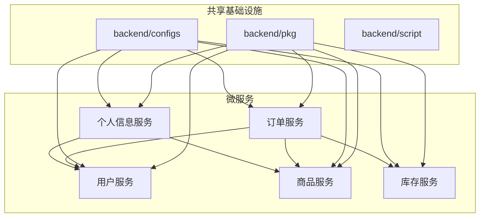

# 系统架构与数据流图

本文档提供 Shop 电商微服务系统的架构图和数据流图，帮助开发者理解系统组件间的关系和数据流转过程。

## 系统架构总览

Shop 电商系统采用领域驱动设计（DDD）和面向接口的架构，按业务领域组织代码，使用 Wire 进行依赖注入，并通过装饰器模式增强核心功能。

```
┌────────────────────────────────────────────┐
│               客户端应用                    │
│  ┌─────────┐  ┌─────────┐  ┌─────────┐     │
│  │ Web前端 │  │移动应用 │  │管理后台 │     │
│  └─────────┘  └─────────┘  └─────────┘     │
└───────────────────┬────────────────────────┘
                    │
┌───────────────────▼────────────────────────┐
│               API网关                       │
│  ┌────────────────────────────────────┐    │
│  │          Nginx/Kong                │    │
│  └────────────────────────────────────┘    │
└───┬───────────┬───────────┬────────────────┘
    │           │           │
┌───▼───┐   ┌───▼───┐   ┌───▼───┐
│用户API│   │商品API│   │订单API│  ...
└───┬───┘   └───┬───┘   └───┬───┘
    │           │           │
┌───▼───────────▼───────────▼───────────────┐
│           微服务集群                       │
│                                           │
│  ┌─────────────────┐ ┌─────────────────┐  │
│  │    用户服务     │ │    商品服务     │  │
│  └─────────────────┘ └─────────────────┘  │
│                                           │
│  ┌─────────────────┐ ┌─────────────────┐  │
│  │    订单服务     │ │    库存服务     │  │
│  └─────────────────┘ └─────────────────┘  │
└───────────────────────────────────────────┘
                    │
┌───────────────────▼───────────────────────┐
│             基础设施                       │
│  ┌─────┐ ┌─────┐ ┌─────┐ ┌─────┐  ┌─────┐ │
│  │MySQL│ │Redis│ │MQ   │ │ES   │  │其他 │ │
│  └─────┘ └─────┘ └─────┘ └─────┘  └─────┘ │
└───────────────────────────────────────────┘

## 技术架构

Shop 电商微服务系统采用现代化的技术栈和最佳实践进行构建，主要技术架构如下：

### 后端技术栈

```
- 开发语言：Go 1.16+
- 微服务框架：gRPC + Protobuf
- API 框架：Gin
- 数据库：MySQL 8.0+、MongoDB 4.4+
- 缓存：Redis 6.0+
- 消息队列：RocketMQ
- 搜索引擎：ElasticSearch 7.x
- 服务发现：Consul
- 配置中心：Nacos
- 链路追踪：Jaeger
- 负载均衡：Nginx
- 日志系统：Zap + Lumberjack
- 依赖注入：Wire
- API 文档：Swagger/OpenAPI
- 容器化：Docker + Docker Compose
```

### 服务组织与共享组件

系统代码组织遵循以下原则：

```
1. 每个业务域一个微服务
2. 每个微服务内部遵循相同的代码结构
3. 共享代码放入全局共享库
4. 配置统一管理并进行分层
5. 服务间通过 gRPC 接口通信
```

Shop 系统后端服务组织架构如下：

```
backend/                # 后端服务根目录
├── go.mod              # Go模块定义
├── go.sum              # Go依赖版本锁定
├── configs/            # 全局通用配置
│   ├── mysql/          # MySQL配置
│   ├── redis/          # Redis配置 
│   ├── consul/         # Consul配置
│   ├── nacos/          # Nacos配置
│   └── jaeger/         # Jaeger配置
├── pkg/                # 全局共享包
│   ├── consul/         # Consul工具
│   ├── nacos/          # Nacos工具
│   ├── grpc/           # gRPC工具
│   ├── logger/         # 日志工具
│   ├── database/       # 数据库工具
│   ├── middleware/     # 中间件
│   ├── auth/           # 认证工具
│   └── util/           # 通用工具函数
├── script/             # 全局脚本
│   ├── build.sh        # 构建脚本
│   ├── deploy.sh       # 部署脚本
│   └── test.sh         # 测试脚本
├── user/               # 用户服务
├── product/            # 商品服务 
├── order/              # 订单服务
├── inventory/          # 库存服务
└── profile/            # 个人信息服务
```

每个微服务均遵循类似的内部结构设计，以用户服务为例：

```
user/
├── cmd/                # 应用入口
│   └── main.go         # 服务启动入口
├── configs/            # 服务特定配置
│   ├── config.go       # 配置加载
│   └── config.yaml     # 配置文件
├── api/                # API定义
│   ├── common/         # 通用定义
│   └── proto/          # Protocol Buffers
│       └── user.proto  # 用户服务接口定义
├── internal/           # 内部实现
│   ├── domain/         # 领域模型
│   │   ├── entity/     # 实体定义
│   │   └── valueobject/ # 值对象
│   ├── repository/     # 数据仓储层
│   │   ├── user_repository.go   # 仓储接口
│   │   ├── user_repository_impl.go # 实现
│   │   ├── cache/      # 缓存实现
│   │   └── dao/        # 数据访问对象
│   ├── service/        # 业务服务层
│   │   ├── auth_service.go      # 认证服务接口
│   │   ├── auth_service_impl.go # 认证服务实现
│   │   ├── user_service.go      # 用户服务接口
│   │   └── user_service_impl.go # 用户服务实现
│   └── web/            # Web交互层
│       ├── grpc/       # gRPC服务实现
│       └── http/       # HTTP服务实现
├── pkg/                # 服务内共享包
│   ├── grpc/           # gRPC工具
│   ├── jwt/            # JWT工具
│   └── util/           # 通用工具
└── script/             # 脚本文件
    └── mysql/          # 数据库脚本
```

### 共享功能和模块依赖

后端服务之间通过共享包(`backend/pkg`)和服务调用实现功能复用：



### 全局共享包 backend/pkg 组织结构

全局共享包包含可在所有微服务中重用的通用功能：

```
pkg/
├── auth/               # 认证相关
│   ├── jwt.go          # JWT工具
│   └── password.go     # 密码处理
├── consul/             # Consul工具
│   ├── register.go     # 服务注册
│   └── resolver.go     # 服务发现
├── database/           # 数据库工具
│   ├── mysql.go        # MySQL连接
│   ├── mongodb.go      # MongoDB连接
│   └── redis.go        # Redis连接
├── grpc/               # gRPC工具
│   ├── client/         # 客户端工具
│   │   ├── conn.go     # 连接管理
│   │   └── interceptor.go # 客户端拦截器
│   └── server/         # 服务端工具
│       ├── server.go   # 服务器封装
│       └── interceptor.go # 服务端拦截器
├── logger/             # 日志工具
│   └── zap.go          # Zap日志配置
├── middleware/         # 中间件
│   ├── ratelimit/      # 限流
│   └── tracing/        # 链路追踪
├── nacos/              # Nacos工具
│   ├── config.go       # 配置获取
│   └── register.go     # 服务注册
└── util/               # 通用工具函数
    ├── pagination.go   # 分页工具
    ├── snowflake.go    # ID生成
    ├── hash.go         # 哈希函数
    └── time.go         # 时间工具
```

## 目录结构

项目采用以下目录结构，按业务领域和功能组织代码:

```
shop/
├── docker-compose.yml  # Docker 部署配置
├── Dockerfile          # Docker 构建文件
├── README.md           # 项目说明
├── doc/                # 详细文档
│   ├── interview.md    # 面试指南
│   ├── 用户服务.md      # 用户服务文档
│   ├── 商品服务.md      # 商品服务文档
│   ├── 订单服务.md      # 订单服务文档
│   ├── 库存服务.md      # 库存服务文档
│   ├── 个人信息服务.md   # 个人信息服务文档
│   └── 系统架构与数据流图.md # 系统架构文档
├── configs/            # 全局配置
│   ├── mysql/          # MySQL配置
│   ├── redis/          # Redis配置
│   ├── consul/         # Consul配置
│   ├── nacos/          # Nacos配置
│   └── jaeger/         # Jaeger配置
├── backend/            # 后端服务
│   ├── user/           # 用户服务
│   │   ├── cmd/                # 应用入口
│   │   │   └── main.go         # 服务启动入口
│   │   ├── configs/            # 服务特定配置
│   │   │   ├── config.go       # 配置加载
│   │   │   └── config.yaml     # 配置文件
│   │   ├── api/                # API定义
│   │   │   ├── common/         # 通用定义
│   │   │   └── proto/          # Protocol Buffers
│   │   │       └── user.proto  # 用户服务接口定义
│   │   ├── internal/           # 内部实现
│   │   │   ├── domain/         # 领域模型
│   │   │   │   ├── entity/     # 实体定义
│   │   │   │   └── valueobject/ # 值对象
│   │   │   ├── repository/     # 数据仓储层
│   │   │   │   ├── user_repository.go   # 仓储接口
│   │   │   │   ├── user_repository_impl.go # 实现
│   │   │   │   ├── cache/      # 缓存实现
│   │   │   │   └── dao/        # 数据访问对象
│   │   │   ├── service/        # 业务服务层
│   │   │   │   ├── auth_service.go      # 认证服务接口
│   │   │   │   ├── auth_service_impl.go # 认证服务实现
│   │   │   │   ├── user_service.go      # 用户服务接口
│   │   │   │   └── user_service_impl.go # 用户服务实现
│   │   │   └── web/            # Web交互层
│   │   │       ├── grpc/       # gRPC服务实现
│   │   │       └── http/       # HTTP服务实现
│   │   ├── pkg/                # 服务内共享包
│   │   │   ├── grpc/           # gRPC工具
│   │   │   ├── jwt/            # JWT工具
│   │   │   └── util/           # 通用工具
│   │   └── script/             # 脚本文件
│   │       └── mysql/          # 数据库脚本
│   ├── product/        # 商品服务（结构类似user服务）
│   ├── order/          # 订单服务（结构类似user服务）
│   ├── inventory/      # 库存服务（结构类似user服务）
│   └── profile/        # 个人信息服务（结构类似user服务）
├── api-gateway/        # API网关
│   ├── configs/        # 网关配置
│   ├── middleware/     # 网关中间件
│   └── routes/         # 路由定义
├── shared/             # 共享库
│   ├── consul/         # Consul工具
│   ├── nacos/          # Nacos工具
│   ├── grpc/           # gRPC工具
│   └── logger/         # 日志工具
└── frontend/           # 前端应用
```

## 各服务子目录结构详解

### 领域层 (domain/)

领域层包含业务核心逻辑和实体，与技术实现无关:

```
domain/
├── entity/                 # 领域实体
│   └── user.go             # 用户实体
├── repository/             # 仓储接口
│   └── user_repository.go  # 用户仓储接口
├── service/                # 领域服务
│   └── user_service.go     # 用户服务定义
├── valueobject/            # 值对象
│   └── credential.go       # 认证值对象
└── event/                  # 领域事件
    └── user_events.go      # 用户相关事件
```

### 内部实现 (internal/)

包含领域接口的具体实现和不应对外暴露的代码:

```
internal/
├── repository/             # 仓储接口实现
│   └── mysql/              # MySQL实现
│       └── user_repo.go    # 用户仓储MySQL实现
├── cache/                  # 缓存实现
│   └── redis/              # Redis实现
│       └── user_cache.go   # 用户缓存实现
├── config/                 # 服务特定配置
│   └── config.go           # 配置加载
└── server/                 # 服务器实现
    └── grpc/               # gRPC服务器
        └── server.go       # 服务器启动逻辑
```

### Web层 (web/)

处理HTTP请求和API相关功能:

```
web/
├── api/                    # API定义
│   └── routes.go           # 路由定义
├── handler/                # 请求处理器
│   └── user_handler.go     # 用户API处理器
├── middleware/             # HTTP中间件
│   └── auth.go             # 认证中间件
└── dto/                    # 数据传输对象
    └── user_dto.go         # 用户DTO
```

### 包 (pkg/)

服务内可共享的工具和组件:

```
pkg/
├── di/                     # 依赖注入
│   ├── wire.go             # Wire依赖图定义
│   └── wire_gen.go         # 生成的依赖注入代码
├── util/                   # 工具函数
│   └── validators.go       # 验证工具
└── client/                 # 客户端库
    └── product_client.go   # 商品服务客户端
```

## 依赖注入与Wire框架

服务使用Google Wire进行依赖注入，以用户服务为例:

```go
// backend/user/pkg/di/wire.go
package di

import (
    "github.com/google/wire"
    "shop/backend/user/domain/repository"
    "shop/backend/user/domain/service"
    "shop/backend/user/internal/repository/mysql"
    "shop/shared/pkg/database"
)

var UserSet = wire.NewSet(
    database.NewMySQLConnection,
    wire.Bind(new(repository.UserRepository), new(*mysql.UserRepositoryImpl)),
    mysql.NewUserRepository,
    service.NewUserService,
)

// 在wire.go中定义依赖图，通过wire命令生成wire_gen.go
```

## 装饰器模式实现

使用装饰器模式解决横切关注点问题，如日志、缓存、指标收集等:

```go
// shared/pkg/decorators/logging.go
package decorators

import (
    "context"
    "shop/backend/user/domain/entity"
    "shop/backend/user/domain/service"
    "shop/shared/pkg/logger"
)

type LoggingUserServiceDecorator struct {
    next   service.UserService
    logger logger.Logger
}

func NewLoggingUserService(next service.UserService, logger logger.Logger) service.UserService {
    return &LoggingUserServiceDecorator{
        next:   next,
        logger: logger,
    }
}

func (d *LoggingUserServiceDecorator) GetUserByID(ctx context.Context, id string) (*entity.User, error) {
    d.logger.Info("Getting user by ID", "user_id", id)
    user, err := d.next.GetUserByID(ctx, id)
    if err != nil {
        d.logger.Error("Failed to get user", "user_id", id, "error", err)
    }
    return user, err
}

// 其他方法实现...
```

依赖注入中组合装饰器:

```go
// backend/user/pkg/di/wire.go
var UserServiceSet = wire.NewSet(
    // 基础依赖...
    service.NewUserService,            // 基础服务
    logger.NewLogger,                  // 日志组件
    wire.Bind(new(service.UserService), new(*decorators.LoggingUserServiceDecorator)),
    decorators.NewLoggingUserService,  // 日志装饰器
    
    // 可以继续添加其他装饰器，如缓存、指标收集等
)
```

## 服务间依赖关系图

服务之间通过定义清晰的接口和领域事件进行通信：

```
                            ┌──────────────┐
                    ┌───────►  用户领域    │
                    │       │  (domain/user)│
                    │       └──────────────┘
                    │              △
                    │              │
┌──────────────┐    │       ┌──────────────┐
│ 个人信息领域  ◄────┘       │  商品领域    │
│(domain/profile)│           │(domain/product)│
└──────┬───────┘            └──────┬───────┘
       │                            │
       │                            │
       │        ┌──────────────┐    │
       └────────►  订单领域    ◄─────┘
                │(domain/order)│
                └──────┬───────┘
                       │
                       │
                       ▼
                ┌──────────────┐
                │  库存领域    │
                │(domain/inventory)│
                └──────────────┘
```

## 主要业务流程数据流图

### 1. 用户下单流程

```
┌─────────┐        ┌─────────┐        ┌─────────┐        ┌─────────┐        ┌─────────┐
│ Web API  │        │ 订单领域 │        │ 商品领域 │        │ 库存领域 │        │  MQ     │
└────┬────┘        └────┬────┘        └────┬────┘        └────┬────┘        └────┬────┘
     │      创建订单     │                  │                  │                  │
     │ ─────────────────>                  │                  │                  │
     │                  │                  │                  │                  │
     │                  │     查询商品      │                  │                  │
     │                  │ ─────────────────>                  │                  │
     │                  │                  │                  │                  │
     │                  │    返回商品信息   │                  │                  │
     │                  │ <─────────────────                  │                  │
     │                  │                  │                  │                  │
     │                  │               锁定库存              │                  │
     │                  │ ───────────────────────────────────>                  │
     │                  │                  │                  │                  │
     │                  │              库存锁定结果           │                  │
     │                  │ <───────────────────────────────────                  │
     │                  │                  │                  │                  │
     │                  │                 发送订单创建事件     │                  │
     │                  │ ──────────────────────────────────────────────────────>
     │                  │                  │                  │                  │
     │    订单创建结果   │                  │                  │                  │
     │ <─────────────────                  │                  │                  │
     │                  │                  │                  │    消费订单事件   │
     │                  │                  │                  │ <─────────────────
     │                  │                  │                  │                  │
     │                  │                  │                  │    更新库存状态   │
     │                  │                  │                  │ ─────────────────>
     │                  │                  │                  │                  │
```

### 2. 用户登录流程

```
┌─────────┐        ┌─────────┐        ┌─────────┐        ┌─────────┐
│ 用户API  │        │ 用户领域 │        │  Redis  │        │  MQ     │
└────┬────┘        └────┬────┘        └────┬────┘        └────┬────┘
     │       登录请求    │                  │                  │
     │ ─────────────────>                  │                  │
     │                  │                  │                  │
     │                  │     查询用户      │                  │
     │                  │ ─────────────────>                  │
     │                  │                  │                  │
     │                  │   缓存未命中     │                  │
     │                  │ <─────────────────                  │
     │                  │                  │                  │
     │                  │    查询数据库    │                  │
     │                  │ ─────┐           │                  │
     │                  │      │           │                  │
     │                  │ <────┘           │                  │
     │                  │                  │                  │
     │                  │    更新缓存      │                  │
     │                  │ ─────────────────>                  │
     │                  │                  │                  │
     │                  │                 记录登录事件        │
     │                  │ ──────────────────────────────────>│
     │                  │                  │                  │
     │     JWT Token    │                  │                  │
     │ <─────────────────                  │                  │
     │                  │                  │                  │
```

### 3. 商品搜索流程

```
┌─────────┐        ┌─────────┐        ┌─────────┐        ┌─────────┐
│ 商品API  │        │ 商品领域 │        │ElasticSearch│    │  MySQL  │
└────┬────┘        └────┬────┘        └────┬────┘        └────┬────┘
     │      搜索请求     │                  │                  │
     │ ─────────────────>                  │                  │
     │                  │                  │                  │
     │                  │     ES搜索       │                  │
     │                  │ ─────────────────>                  │
     │                  │                  │                  │
     │                  │    搜索结果      │                  │
     │                  │ <─────────────────                  │
     │                  │                  │                  │
     │                  │              补充商品详情           │
     │                  │ ───────────────────────────────────>
     │                  │                  │                  │
     │                  │              商品详情数据           │
     │                  │ <───────────────────────────────────
     │                  │                  │                  │
     │    搜索结果列表   │                  │                  │
     │ <─────────────────                  │                  │
     │                  │                  │                  │
```

## 领域内部组件图

### 用户领域 (domain/user)

```
┌─────────────────────────────────────────────┐
│              用户领域 (domain/user)          │
│                                             │
│  ┌─────────────┐       ┌─────────────┐      │
│  │  用户实体   │       │  认证值对象 │      │
│  └──────┬──────┘       └──────┬──────┘      │
│         │                     │             │
│         ▼                     ▼             │
│  ┌─────────────┐       ┌─────────────┐      │
│  │ 用户仓储接口 │       │ 用户服务    │      │
│  └──────┬──────┘       └─────────────┘      │
│         │                     ▲             │
│         │                     │             │
│         │                     │             │
│         │    ┌─────────────────────────┐    │
│         └───►│      装饰器增强层       │    │
│              │ (日志/缓存/指标/追踪)   │    │
│              └─────────────────────────┘    │
└─────────────────────────────────────────────┘
```

### 商品领域 (domain/product)

```
┌─────────────────────────────────────────────┐
│           商品领域 (domain/product)          │
│                                             │
│  ┌─────────────┐       ┌─────────────┐      │
│  │ 商品实体    │       │ 分类实体    │      │
│  └──────┬──────┘       └──────┬──────┘      │
│         │                     │             │
│         ▼                     ▼             │
│  ┌─────────────┐       ┌─────────────┐      │
│  │ 品牌实体    │       │ 商品服务    │      │
│  └──────┬──────┘       └──────┬──────┘      │
│         │                     │             │
│         ▼                     ▼             │
│  ┌─────────────┐       ┌─────────────┐      │
│  │ 商品仓储接口 │       │ 搜索服务    │      │
│  └─────────────┘       └─────────────┘      │
│                                             │
│         ┌─────────────────────────┐         │
│         │       装饰器增强层      │         │
│         │ (日志/缓存/指标/追踪)   │         │
数据库表结构与之前的设计保持一致，只是在代码层面改变了组织方式。

## 部署架构图

部署架构与之前相似，但每个服务的内部结构发生了变化：

```
┌─────────────────────────────────────────────┐
│             微服务部署架构(Kubernetes)       │
│                                             │
│  ┌─────────────────────────────────────┐    │
│  │  API网关 (Kong/Nginx)               │    │
│  └─────────────────────────────────────┘    │
│                                             │
│  ┌─────────────────────────────────────┐    │
│  │             微服务集群               │    │
│  │  ┌───────┐  ┌───────┐  ┌───────┐    │    │
│  │  │用户服务│  │商品服务│  │订单服务│    │    │
│  │  └───────┘  └───────┘  └───────┘    │    │
│  │                                     │    │
│  │  ┌───────┐  ┌───────────────────┐   │    │
│  │  │库存服务│  │个人信息服务       │   │    │
│  │  └───────┘  └───────────────────┘   │    │
│  └─────────────────────────────────────┘    │
│                                             │
│  ┌─────────────┐       ┌─────────────┐      │
│  │ MySQL集群   │       │ Redis集群   │      │
│  └─────────────┘       └─────────────┘      │
│                                             │
│  ┌─────────────┐       ┌─────────────┐      │
│  │  ES集群     │       │  MQ集群     │      │
│  └─────────────┘       └─────────────┘      │
│                                             │
│  ┌─────────────────────────────────────┐    │
│  │  监控系统(Prometheus/Grafana)        │    │
│  └─────────────────────────────────────┘    │
└─────────────────────────────────────────────┘
```

## 参考资料

- [领域驱动设计(DDD)](https://martinfowler.com/bliki/DomainDrivenDesign.html)
- [装饰器模式](https://refactoring.guru/design-patterns/decorator)
- [Wire依赖注入框架](https://github.com/google/wire)
- [Go项目标准布局](https://github.com/golang-standards/project-layout)
- [Clean Architecture](https://blog.cleancoder.com/uncle-bob/2012/08/13/the-clean-architecture.html)

## 文档维护

1. 所有架构变更需要在架构决策记录(ADR)中记录
2. 架构变更后，需同步更新本文档中的相关图表
3. 使用标准符号表示法保持图表一致性
4. 保持图表的简洁和可读性