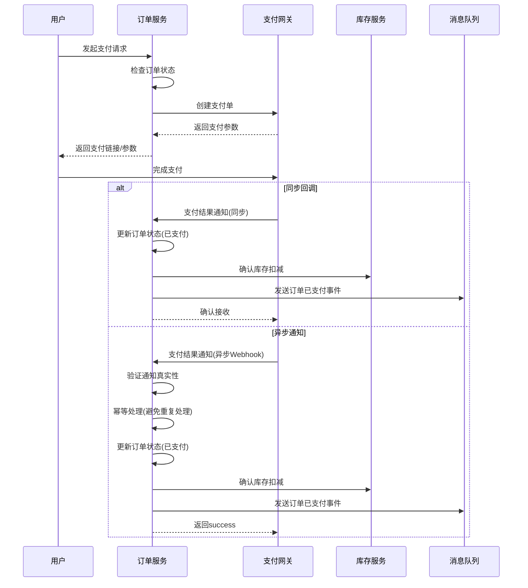

# 订单服务 (Order Service)

订单服务是 Shop 电商系统中负责交易流程的核心服务，提供购物车管理、订单处理、支付集成、售后服务等完整的交易链路功能，确保用户购物体验的流畅性和交易数据的准确性。

## 目录

1. [功能概述](#1-功能概述)
2. [系统架构](#2-系统架构)
3. [数据模型](#3-数据模型)
4. [API 接口说明](#4-api-接口说明)
5. [业务流程](#5-业务流程)
6. [代码结构](#6-代码结构)
7. [技术栈实现](#7-技术栈实现)
8. [分布式事务](#8-分布式事务)
9. [安全机制](#9-安全机制)
10. [高可用设计](#10-高可用设计)
11. [性能优化](#11-性能优化)
12. [监控告警](#12-监控告警)
13. [gRPC 服务实现](#13-grpc-服务实现)
14. [灾难恢复策略](#14-灾难恢复策略)

## 1. 功能概述

订单服务提供以下核心功能：

- **购物车管理**：

  - 添加、更新、删除购物车中的商品
  - 商品选择与取消选择
  - 购物车商品数量调整
  - 购物车商品价格实时更新
  - 购物车商品有效性检查

- **订单处理**：

  - 基于购物车创建订单
  - 直接购买创建订单
  - 订单价格计算（含优惠券、积分等）
  - 订单确认与提交
  - 订单超时自动取消
  - 订单列表和详情查询
  - 订单状态追踪与更新

- **支付集成**：

  - 多种支付方式集成（支付宝、微信支付、银行卡等）
  - 支付状态查询
  - 支付回调处理
  - 支付超时处理
  - 退款处理

- **配送管理**：

  - 配送信息管理
  - 物流状态追踪
  - 送达确认

- **售后服务**：

  - 订单取消
  - 退款申请
  - 退货/换货处理
  - 售后状态跟踪

- **统计分析**：
  - 销售数据统计
  - 订单转化率分析
  - 支付方式分析
  - 订单来源分析

订单服务作为交易流程的核心引擎，需要与多个服务协调工作，确保交易的顺利进行和数据的一致性。系统采用事件驱动架构和分布式事务管理，保证在高并发场景下的稳定性和数据准确性。

## 2. 系统架构

订单服务采用领域驱动设计(DDD)和微服务架构，将订单处理流程分解为多个独立的业务领域。

### 2.1 系统架构图

```
┌───────────────────────────────────────────────────────────┐
│                   订单服务 (Order Service)                 │
│                                                           │
│  ┌─────────────┐   ┌─────────────┐   ┌─────────────┐      │
│  │ 购物车模块  │   │  订单模块   │   │  支付模块   │      │
│  │(购物车管理) │   │(订单处理)   │   │(支付集成)   │      │
│  └──────┬──────┘   └──────┬──────┘   └──────┬──────┘      │
│         │                 │                 │             │
│  ┌─────────────┐   ┌──────▼──────┐   ┌─────────────┐      │
│  │ 优惠模块    │   │ 事件处理器  │   │ 售后模块    │      │
│  │(优惠券/积分)│   │(状态转换)   │   │(退款/退换货)│      │
│  └──────┬──────┘   └──────┬──────┘   └──────┬──────┘      │
│         │                 │                 │             │
│         └─────────────────┼─────────────────┘             │
│                           │                               │
└───────────────────────────┼───────────────────────────────┘
                            │
┌───────────────────────────┼───────────────────────────────┐
│                   服务协作与基础设施                      │
├─────────────┬─────────────┬────────────┬─────────────┬────┘
│             │             │            │             │
▼             ▼             ▼            ▼             ▼
┌─────────┐ ┌─────────┐ ┌──────────┐ ┌─────────┐ ┌─────────┐
│ 用户服务 │ │ 商品服务 │ │ 库存服务  │ │ 支付网关 │ │ 消息队列 │
└─────────┘ └─────────┘ └──────────┘ └─────────┘ └─────────┘
```

### 2.2 核心领域模型

订单服务的核心领域模型遵循 DDD 设计原则：

```
┌─────────────────┐       ┌─────────────────┐
│     Order       │       │   ShoppingCart  │
│  (订单聚合根)    │◄─────┐│  (购物车聚合根) │
└─────────────────┘      ││└─────────────────┘
        △                │        △
        │                │        │
┌─────────────────┐      │┌─────────────────┐
│   OrderItem     │      ││  CartItem       │
│ (订单项值对象)   │      ││ (购物车项值对象) │
└─────────────────┘      │└─────────────────┘
                         │
┌─────────────────┐      │┌─────────────────┐
│   Payment       │      ││   Promotion     │
│ (支付聚合根)     │◄─────┤│  (优惠聚合根)   │
└─────────────────┘      │└─────────────────┘
        △                │
        │                │
┌─────────────────┐      │┌─────────────────┐
│  RefundRequest  │      ││  DeliveryInfo   │
│ (退款请求实体)   │◄─────┘│ (配送信息值对象) │
└─────────────────┘       └─────────────────┘
```

## 2. 数据模型

订单服务的主要数据模型包括：

### 2.1 购物车表 (ShoppingCart)

```sql
CREATE TABLE `shopping_cart` (
  `id` int(11) NOT NULL AUTO_INCREMENT,
  `user` int(11) NOT NULL COMMENT '用户ID',
  `goods` int(11) NOT NULL COMMENT '商品ID',
  `nums` int(11) NOT NULL COMMENT '商品数量',
  `checked` tinyint(1) DEFAULT 1 COMMENT '是否选中',
  `created_at` datetime(3) DEFAULT NULL,
  `updated_at` datetime(3) DEFAULT NULL,
  `deleted_at` datetime(3) DEFAULT NULL,
  PRIMARY KEY (`id`),
  INDEX `idx_user` (`user`)
) ENGINE=InnoDB DEFAULT CHARSET=utf8mb4;
```

### 2.2 订单表 (OrderInfo)

```sql
CREATE TABLE `order_info` (
  `id` int(11) NOT NULL AUTO_INCREMENT,
  `user` int(11) NOT NULL COMMENT '用户ID',
  `order_sn` varchar(30) NOT NULL COMMENT '订单号',
  `pay_type` varchar(20) NOT NULL DEFAULT 'alipay' COMMENT '支付方式：alipay, wechat',
  `status` int(11) NOT NULL DEFAULT 1 COMMENT '订单状态：1-待支付，2-已支付，3-已发货，4-已完成，5-已取消',
  `trade_no` varchar(100) DEFAULT '' COMMENT '交易号',
  `order_mount` float NOT NULL DEFAULT 0 COMMENT '订单金额',
  `pay_time` datetime DEFAULT NULL COMMENT '支付时间',
  `address` varchar(255) NOT NULL COMMENT '收货地址',
  `signer_name` varchar(50) NOT NULL COMMENT '收货人姓名',
  `signer_mobile` varchar(11) NOT NULL COMMENT '收货人手机号',
  `post` varchar(20) DEFAULT '' COMMENT '邮编',
  `note` varchar(255) DEFAULT '' COMMENT '订单备注',
  `created_at` datetime(3) DEFAULT NULL,
  `updated_at` datetime(3) DEFAULT NULL,
  `deleted_at` datetime(3) DEFAULT NULL,
  PRIMARY KEY (`id`),
  UNIQUE KEY `idx_order_sn` (`order_sn`),
  INDEX `idx_user` (`user`)
) ENGINE=InnoDB DEFAULT CHARSET=utf8mb4;
```

### 2.3 订单商品表 (OrderGoods)

```sql
CREATE TABLE `order_goods` (
  `id` int(11) NOT NULL AUTO_INCREMENT,
  `order` int(11) NOT NULL COMMENT '订单ID',
  `goods` int(11) NOT NULL COMMENT '商品ID',
  `goods_name` varchar(100) NOT NULL COMMENT '商品名称',
  `goods_image` varchar(255) DEFAULT '' COMMENT '商品图片',
  `goods_price` float NOT NULL COMMENT '商品价格',
  `nums` int(11) NOT NULL COMMENT '商品数量',
  `created_at` datetime(3) DEFAULT NULL,
  `updated_at` datetime(3) DEFAULT NULL,
  `deleted_at` datetime(3) DEFAULT NULL,
  PRIMARY KEY (`id`),
  INDEX `idx_order` (`order`),
  INDEX `idx_goods` (`goods`)
) ENGINE=InnoDB DEFAULT CHARSET=utf8mb4;
```

## 3. API 接口说明

订单服务的主要 gRPC 接口包括：

### 3.1 购物车相关接口

```protobuf
// 添加购物车
rpc AddShoppingCart(CartItemRequest) returns (ShoppingCartInfo);

// 更新购物车
rpc UpdateShoppingCart(CartItemRequest) returns (google.protobuf.Empty);

// 删除购物车
rpc DeleteShoppingCart(CartItemRequest) returns (google.protobuf.Empty);

// 获取购物车列表
rpc GetShoppingCart(UserInfo) returns (CartItemListResponse);

// 购物车选择状态
rpc UpdateCartItemCheck(CartItemRequest) returns (google.protobuf.Empty);
```

### 3.2 订单相关接口

```protobuf
// 创建订单
rpc CreateOrder(OrderRequest) returns (OrderInfoResponse);

// 获取订单列表
rpc OrderList(OrderFilterRequest) returns (OrderListResponse);

// 获取订单详情
rpc OrderDetail(OrderRequest) returns (OrderInfoDetailResponse);

// 更新订单状态
rpc UpdateOrderStatus(OrderStatus) returns (google.protobuf.Empty);
```

### 3.3 支付相关接口

```protobuf
// 支付订单
rpc PayOrder(OrderPayRequest) returns (OrderPayResponse);

// 支付回调
rpc OrderPayCallback(OrderPayCallbackRequest) returns (google.protobuf.Empty);
```

## 4. 业务流程

### 4.1 购物车管理流程

1. 用户添加商品到购物车

   - 调用商品服务获取商品信息
   - 检查商品是否存在
   - 如果购物车中已有该商品，则更新数量
   - 否则添加新商品到购物车

2. 用户查看购物车
   - 获取用户的购物车商品列表
   - 调用商品服务批量获取最新的商品信息（价格、状态等）
   - 返回合并后的购物车商品列表

### 4.2 订单创建流程

1. 用户提交订单

   - 从购物车获取选中的商品
   - 调用商品服务获取最新的商品信息和价格
   - 计算订单总金额
   - 生成唯一的订单号
   - 调用库存服务锁定库存
   - 创建订单记录和订单商品记录
   - 清空购物车中已下单的商品
   - 返回订单信息和支付链接

2. 订单超时处理
   - 定时任务检查超时未支付的订单
   - 更新订单状态为"已取消"
   - 发送消息通知库存服务归还库存

### 4.3 订单支付流程

1. 用户请求支付订单

   - 检查订单状态是否为"待支付"
   - 生成支付宝/微信支付参数
   - 返回支付链接或支付二维码

2. 支付结果处理
   - 接收支付平台的异步通知
   - 验证支付通知的真实性
   - 查询并更新订单状态为"已支付"
   - 发送消息通知其他服务（如库存服务确认扣减）

### 4.4 订单状态变更流程

1. 订单发货

   - 管理员在后台确认发货
   - 更新订单状态为"已发货"
   - 记录物流信息
   - 通知用户订单已发货

2. 订单完成
   - 用户确认收货或系统自动确认（超过时间）
   - 更新订单状态为"已完成"
   - 增加商品销量统计
   - 生成用户消费记录

## 5. 业务流程

订单服务涉及多个关键业务流程，下面详细介绍主要业务场景的实现流程。

### 5.1 订单创建流程

用户下单是电商系统最核心的流程之一，涉及多个微服务的协作：


### 5.2 订单支付流程

订单支付流程涉及支付网关交互和多服务状态更新：



### 5.3 订单超时取消流程

为防止订单占用库存但未支付，系统实现了自动取消机制：


### 5.4 退款处理流程

订单退款流程包含审核、退款执行和状态更新：


### 5.5 订单状态变更流程

订单状态变更采用状态机设计，确保状态转换的安全性和一致性：

```go
// 订单状态定义
const (
    OrderStatusCreated     = 1 // 已创建
    OrderStatusPaid        = 2 // 已支付
    OrderStatusShipped     = 3 // 已发货
    OrderStatusDelivered   = 4 // 已送达
    OrderStatusCompleted   = 5 // 已完成
    OrderStatusCancelled   = 6 // 已取消
    OrderStatusRefunding   = 7 // 退款中
    OrderStatusRefunded    = 8 // 已退款
)

// 订单状态机定义
var orderStateMachine = map[int][]int{
    OrderStatusCreated:   {OrderStatusPaid, OrderStatusCancelled},
    OrderStatusPaid:      {OrderStatusShipped, OrderStatusRefunding, OrderStatusCancelled},
    OrderStatusShipped:   {OrderStatusDelivered, OrderStatusRefunding},
    OrderStatusDelivered: {OrderStatusCompleted, OrderStatusRefunding},
    OrderStatusCompleted: {OrderStatusRefunding},
    OrderStatusRefunding: {OrderStatusRefunded, OrderStatusCancelled},
    OrderStatusRefunded:  {},
    OrderStatusCancelled: {},
}

// 验证状态转换
func (s *orderService) validateStatusTransition(from, to int) bool {
    allowedStates, exists := orderStateMachine[from]
    if (!exists) {
        return false
    }

    for _, state := range allowedStates {
        if (state == to) {
            return true
        }
    }

    return false
}

// 更新订单状态
func (s *orderService) updateOrderStatus(ctx context.Context, orderSn string, fromStatus, toStatus int) error {
    // 验证状态转换合法性
    if (!s.validateStatusTransition(fromStatus, toStatus)) {
        return fmt.Errorf("invalid status transition from %d to %d", fromStatus, toStatus)
    }

    // 使用乐观锁更新状态
    result, err := s.repo.UpdateOrderStatus(ctx, orderSn, fromStatus, toStatus)
    if (err != nil) {
        return err
    }

    if (result.RowsAffected == 0) {
        return fmt.Errorf("order status was modified by another process")
    }

    // 发送状态变更事件
    event := &event.OrderStatusChanged{
        OrderSn:    orderSn,
        OldStatus:  fromStatus,
        NewStatus:  toStatus,
        UpdateTime: time.Now(),
    }

    if (err := s.eventPublisher.Publish(ctx, event)) {
        s.logger.Error("Failed to publish order status change event",
            zap.String("orderSn", orderSn),
            zap.Int("fromStatus", fromStatus),
            zap.Int("toStatus", toStatus),
            zap.Error(err))
        // 继续处理，不影响主流程
    }

    return nil
}
```

## 6. 分布式事务处理

订单服务涉及多个微服务间的协作，需要处理分布式事务以确保数据一致性。

### 6.1 Saga 模式

订单创建过程中使用 Saga 模式处理跨服务事务：

```go
// Saga 交易流程示例
func (s *orderService) createOrderSaga(ctx context.Context, req *proto.CreateOrderRequest) (*proto.OrderInfo, error) {
    sagaLog := saga.NewMemoryLog()
    sagaCoordinator := saga.NewCoordinator(sagaLog, s.logger)

    // 第一步：创建订单记录
    createOrderStep := saga.NewStep(
        // 正向操作：创建订单
        func(ctx context.Context) error {
            var err error
            order, err = s.repo.CreateOrder(ctx, orderModel)
            return err
        },
        // 补偿操作：删除订单
        func(ctx context.Context) error {
            if (order != nil) {
                return s.repo.DeleteOrder(ctx, order.OrderSn)
            }
            return nil
        },
    )

    // 第二步：锁定库存
    lockInventoryStep := saga.NewStep(
        // 正向操作：锁定库存
        func(ctx context.Context) error {
            req := &inventory.LockRequest{
                OrderSn: order.OrderSn,
                Items:   make([]*inventory.LockItem, 0, len(orderItems)),
            }
            // 构建库存锁定请求...

            resp, err := s.inventoryClient.Lock(ctx, req)
            inventoryLocked = err == nil && resp.Success
            return err
        },
        // 补偿操作：释放库存
        func(ctx context.Context) error {
            if (inventoryLocked) {
                return s.inventoryClient.Unlock(ctx, &inventory.UnlockRequest{
                    OrderSn: order.OrderSn,
                })
            }
            return nil
        },
    )

    // 执行Saga流程
    err := sagaCoordinator.Execute(ctx, createOrderStep, lockInventoryStep)
    if (err != nil) {
        return nil, err
    }

    // 成功创建订单，返回结果
    return convertOrderToProto(order), nil
}
```

### 6.2 TCC 模式

支付过程使用 TCC（Try-Confirm-Cancel）模式确保事务完整性：

1. **Try 阶段**：创建支付记录，冻结用户资金
2. **Confirm 阶段**：确认支付，实际扣款
3. **Cancel 阶段**：取消支付，解冻资金

### 6.3 事件溯源

订单服务采用事件溯源机制记录所有订单状态变更：

1. 所有状态变更保存为事件
2. 通过重放事件可以重建订单完整历史
3. 支持事件追踪和系统审计

## 6. 代码结构

订单服务采用整洁架构和领域驱动设计(DDD)原则，代码结构如下：

```
backend/order/
├── cmd/                # 应用入口
│   └── main.go         # 服务启动入口
├── configs/            # 服务特定配置
│   ├── config.go       # 配置加载
│   └── config.yaml     # 配置文件
├── api/                # API定义
│   ├── common/         # 通用定义
│   └── proto/          # Protocol Buffers
│       └── order.proto # 订单服务接口定义
├── internal/           # 内部实现
│   ├── domain/         # 领域模型
│   │   ├── entity/     # 实体定义
│   │   │   ├── order.go     # 订单实体
│   │   │   ├── order_item.go # 订单项实体
│   │   │   └── cart.go      # 购物车实体
│   │   ├── valueobject/ # 值对象
│   │   │   ├── address.go   # 地址值对象
│   │   │   └── payment.go   # 支付值对象
│   │   └── event/       # 领域事件
│   │       └── order_events.go # 订单相关事件
│   ├── repository/     # 数据仓储层
│   │   ├── order_repository.go # 仓储接口
│   │   ├── order_repository_impl.go # 实现
│   │   ├── cart_repository.go # 购物车仓储接口
│   │   ├── cart_repository_impl.go # 购物车仓储实现
│   │   ├── cache/      # 缓存实现
│   │   │   └── redis_cache.go # Redis缓存
│   │   └── dao/        # 数据访问对象
│   │       ├── order_dao.go  # 订单DAO
│   │       ├── order_item_dao.go # 订单项DAO
│   │       └── cart_dao.go   # 购物车DAO
│   ├── service/        # 业务服务层
│   │   ├── order_service.go  # 订单服务接口
│   │   ├── order_service_impl.go # 订单服务实现
│   │   ├── cart_service.go   # 购物车服务接口
│   │   ├── cart_service_impl.go # 购物车服务实现
│   │   ├── payment_service.go # 支付服务接口
│   │   └── payment_service_impl.go # 支付服务实现
│   └── web/            # Web交互层
│       ├── grpc/       # gRPC服务实现
│       │   └── order_grpc_handler.go # gRPC处理器
│       └── http/       # HTTP服务实现
│           └── order_handler.go # HTTP处理器
├── pkg/                # 服务内共享包
│   ├── util/           # 通用工具
│   │   └── snowflake.go # 分布式ID生成
│   ├── state/          # 状态机
│   │   └── order_state.go # 订单状态机
│   ├── payment/        # 支付集成
│   │   ├── alipay/     # 支付宝支付
│   │   └── wechat/     # 微信支付
│   └── client/         # 客户端工具
│       ├── product_client.go # 商品服务客户端
│       └── inventory_client.go # 库存服务客户端
└── script/             # 脚本文件
    └── mysql/          # 数据库脚本
        ├── schema.sql  # 表结构
        └── migrations/ # 数据库迁移
```

## 7. 技术栈实现

订单服务集成了多种现代技术栈，以提供高性能、高可用的服务：

### 7.1 gRPC 通信

订单服务使用 gRPC 作为微服务间通信的主要协议：

- 使用 Protocol Buffers 定义服务接口和数据结构，确保类型安全
- 通过拦截器实现日志记录、熔断、超时控制等横切关注点
- 实现双向流通信支持订单状态实时更新和推送
- 使用 gRPC 健康检查实现服务健康监控

```go
// 示例：gRPC 服务器设置拦截器
func setupGRPCServer(logger *zap.Logger) *grpc.Server {
    // 创建限流器
    rateLimiter := rate.NewLimiter(rate.Limit(100), 200)

    // 设置拦截器链
    opts := []grpc.ServerOption{
        grpc.ChainUnaryInterceptor(
            // 请求日志记录
            func(ctx context.Context, req interface{}, info *grpc.UnaryServerInfo, handler grpc.UnaryHandler) (interface{}, error) {
                start := time.Now()
                resp, err := handler(ctx, req)
                logger.Info("gRPC request",
                    zap.String("method", info.FullMethod),
                    zap.Duration("duration", time.Since(start)),
                    zap.Error(err),
                )
                return resp, err
            },
            // 限流拦截器
            func(ctx context.Context, req interface{}, info *grpc.UnaryServerInfo, handler grpc.UnaryHandler) (interface{}, error) {
                if !rateLimiter.Allow() {
                    return nil, status.Errorf(codes.ResourceExhausted, "too many requests")
                }
                return handler(ctx, req)
            },
            // 恢复拦截器，捕获 panic
            func(ctx context.Context, req interface{}, info *grpc.UnaryServerInfo, handler grpc.UnaryHandler) (interface{}, error) {
                defer func() {
                    if r := recover(); r != nil {
                        logger.Error("Recovered from panic", zap.Any("panic", r), zap.Stack("stack"))
                    }
                }()
                return handler(ctx, req)
            },
        ),
    }

    return grpc.NewServer(opts...)
}
```

### 7.2 Consul 服务发现

订单服务使用 Consul 进行服务注册和发现：

- 服务启动时自动注册到 Consul
- 通过 Consul 健康检查保证只有健康的服务实例接收流量
- 服务发现使用 Consul DNS 或 HTTP API
- 使用 Consul KV 存储共享配置和分布式锁

```go
// 示例：服务注册到 Consul
func registerServiceWithConsul(cfg *config.Config) {
    consulConfig := consul.DefaultConfig()
    consulConfig.Address = cfg.Consul.Address

    client, err := consul.NewClient(consulConfig)
    if err != nil {
        log.Fatalf("Failed to create consul client: %v", err)
    }

    // 定义服务注册信息
    registration := &consul.AgentServiceRegistration{
        ID:      fmt.Sprintf("order-service-%s-%d", cfg.Host, cfg.Port),
        Name:    "order-service",
        Port:    cfg.Port,
        Address: cfg.Host,
        Tags:    []string{"order", "payment", "grpc"},
        Check: &consul.AgentServiceCheck{
            GRPC:                           fmt.Sprintf("%s:%d/%s", cfg.Host, cfg.Port, "health"),
            Interval:                       "10s",
            Timeout:                        "5s",
            DeregisterCriticalServiceAfter: "90s",
        },
    }

    // 注册服务
    if err := client.Agent().ServiceRegister(registration); err != nil {
        log.Fatalf("Failed to register service: %v", err)
    }

    // 注册关闭钩子
    c := make(chan os.Signal, 1)
    signal.Notify(c, os.Interrupt, syscall.SIGTERM)
    go func() {
        <-c
        if err := client.Agent().ServiceDeregister(registration.ID); err != nil {
            log.Printf("Failed to deregister service: %v", err)
        }
        os.Exit(0)
    }()
}
```

### 7.3 Nacos 配置中心

订单服务使用 Nacos 进行配置管理：

- 集中管理订单服务配置，支持环境隔离
- 配置热更新，无需重启服务
- 支持命名空间和配置分组
- 配置变更历史和回滚功能

```go
// 示例：从 Nacos 加载配置
func loadConfigFromNacos() (*config.AppConfig, error) {
    // 创建 ServerConfig
    sc := []constant.ServerConfig{
        {
            IpAddr: "nacos-server",
            Port:   8848,
        },
    }

    // 创建 ClientConfig
    cc := constant.ClientConfig{
        TimeoutMs:           5000,
        NotLoadCacheAtStart: true,
        LogLevel:            "error",
    }

    // 创建配置客户端
    client, err := clients.CreateConfigClient(map[string]interface{}{
        "serverConfigs": sc,
        "clientConfig":  cc,
    })
    if err != nil {
        return nil, fmt.Errorf("create nacos config client failed: %w", err)
    }

    // 获取配置
    content, err := client.GetConfig(vo.ConfigParam{
        DataId: "order-service.yaml",
        Group:  "DEFAULT_GROUP",
    })
    if err != nil {
        return nil, fmt.Errorf("get config from nacos failed: %w", err)
    }

    // 解析配置
    var appConfig config.AppConfig
    if err := yaml.Unmarshal([]byte(content), &appConfig); err != nil {
        return nil, fmt.Errorf("unmarshal config failed: %w", err)
    }

    // 监听配置变化
    client.ListenConfig(vo.ConfigParam{
        DataId: "order-service.yaml",
        Group:  "DEFAULT_GROUP",
        OnChange: func(namespace, group, dataId, data string) {
            fmt.Printf("Config changed: %s\n", data)
            // 更新应用配置
            var newConfig config.AppConfig
            if err := yaml.Unmarshal([]byte(data), &newConfig); err != nil {
                fmt.Printf("Failed to parse updated config: %v\n", err)
                return
            }
            // 更新应用配置（实际应用中需要考虑并发安全）
            appConfig = newConfig
        },
    })

    return &appConfig, nil
}
```

### 7.4 MongoDB 存储

订单服务使用 MongoDB 存储订单日志和统计数据：

- 订单操作日志存储，记录订单状态变更历史
- 订单统计数据存储，支持灵活查询和聚合
- 支持大数据量高性能读写
- 提供轻量级事务支持

```go
// 示例：MongoDB 订单日志记录结构
type OrderLog struct {
    ID          primitive.ObjectID `bson:"_id,omitempty"`
    OrderSn     string             `bson:"order_sn"`
    UserID      int64              `bson:"user_id"`
    Action      string             `bson:"action"` // create, pay, cancel, ship, complete
    OldStatus   int                `bson:"old_status"`
    NewStatus   int                `bson:"new_status"`
    Operator    string             `bson:"operator"` // user, system, admin
    OperatorID  int64              `bson:"operator_id"`
    Reason      string             `bson:"reason,omitempty"`
    Timestamp   time.Time          `bson:"timestamp"`
    Details     interface{}        `bson:"details,omitempty"`
}

// MongoDB 订单日志记录
func (s *orderService) logOrderOperation(ctx context.Context, log *OrderLog) error {
    collection := s.mongoClient.Database("shop_logs").Collection("order_logs")

    log.ID = primitive.NewObjectID()
    if log.Timestamp.IsZero() {
        log.Timestamp = time.Now()
    }

    ctx, cancel := context.WithTimeout(ctx, 5*time.Second)
    defer cancel()

    _, err := collection.InsertOne(ctx, log)
    if err != nil {
        s.logger.Error("Failed to insert order log", zap.Error(err), zap.String("order_sn", log.OrderSn))
        return err
    }

    return nil
}
```

### 7.5 Swagger API 文档

订单服务通过 Swagger 生成 REST API 文档：

- 自动从代码注释生成 API 文档
- 支持在线测试 API
- 严格的 API 版本控制
- 导出多种格式的文档

```go
// 示例：Swagger 接口文档注释
// @Summary 创建订单
// @Description 从购物车创建新订单
// @Tags orders
// @Accept json
// @Produce json
// @Param Authorization header string true "用户令牌"
// @Param CreateOrderRequest body CreateOrderRequest true "订单创建请求"
// @Success 200 {object} OrderResponse
// @Failure 400 {object} ErrorResponse
// @Failure 401 {object} ErrorResponse
// @Failure 500 {object} ErrorResponse
// @Router /api/v1/orders [post]
func (h *OrderHandler) CreateOrder(c *gin.Context) {
    var req CreateOrderRequest
    if err := c.ShouldBindJSON(&req); err != nil {
        c.JSON(http.StatusBadRequest, ErrorResponse{Code: 400, Message: err.Error()})
        return
    }

    // 业务逻辑处理...

    c.JSON(http.StatusOK, OrderResponse{
        Code:    200,
        Message: "订单创建成功",
        Data:    orderData,
    })
}
```

### 7.6 Zap 日志系统

订单服务使用 Zap 进行高性能日志记录：

- 结构化日志格式，便于分析和查询
- 高性能批量写入，最小化 I/O 操作
- 多级别日志支持
- 自动日志轮转和归档

```go
// 示例：配置 Zap 日志
func initLogger(cfg *config.Config) (*zap.Logger, error) {
    // 日志文件配置
    lumberJackLogger := &lumberjack.Logger{
        Filename:   cfg.Log.Filename,
        MaxSize:    cfg.Log.MaxSize,    // MB
        MaxBackups: cfg.Log.MaxBackups,
        MaxAge:     cfg.Log.MaxAge,     // days
        Compress:   cfg.Log.Compress,
    }

    // 日志编码配置
    encoderConfig := zapcore.EncoderConfig{
        TimeKey:        "time",
        LevelKey:       "level",
        NameKey:        "logger",
        CallerKey:      "caller",
        FunctionKey:    zapcore.OmitKey,
        MessageKey:     "msg",
        StacktraceKey:  "stacktrace",
        LineEnding:     zapcore.DefaultLineEnding,
        EncodeLevel:    zapcore.LowercaseLevelEncoder,
        EncodeTime:     zapcore.ISO8601TimeEncoder,
        EncodeDuration: zapcore.SecondsDurationEncoder,
        EncodeCaller:   zapcore.ShortCallerEncoder,
    }

    // 配置日志级别
    var level zapcore.Level
    switch cfg.Log.Level {
    case "debug":
        level = zap.DebugLevel
    case "info":
        level = zap.InfoLevel
    case "warn":
        level = zap.WarnLevel
    case "error":
        level = zap.ErrorLevel
    default:
        level = zap.InfoLevel
    }

    // 配置日志核心
    core := zapcore.NewCore(
        zapcore.NewJSONEncoder(encoderConfig),
        zapcore.NewMultiWriteSyncer(zapcore.AddSync(lumberJackLogger), zapcore.AddSync(os.Stdout)),
        level,
    )

    // 创建日志实例
    logger := zap.New(core, zap.AddCaller(), zap.AddCallerSkip(1))

    return logger, nil
}
```

### 7.7 Nginx API 网关

订单服务使用 Nginx 作为 API 网关：

- 反向代理订单服务的 HTTP API
- 负载均衡多个订单服务实例
- SSL 终止和 HTTPS 支持
- 请求限流和 CORS 配置

```nginx
# Nginx 配置示例
upstream order_service {
    server order-service-1:8080;
    server order-service-2:8080;
    server order-service-3:8080;
    keepalive 32;
}

server {
    listen 443 ssl http2;
    server_name api.shop.example.com;

    ssl_certificate     /etc/nginx/certs/shop.crt;
    ssl_certificate_key /etc/nginx/certs/shop.key;

    # 订单 API
    location /api/v1/orders {
        # 限流配置
        limit_req zone=api burst=20 nodelay;

        # CORS 支持
        add_header 'Access-Control-Allow-Origin' '*';
        add_header 'Access-Control-Allow-Methods' 'GET, POST, PUT, DELETE, OPTIONS';
        add_header 'Access-Control-Allow-Headers' 'DNT,X-CustomHeader,Keep-Alive,User-Agent,X-Requested-With,If-Modified-Since,Cache-Control,Content-Type,Authorization';

        if ($request_method = 'OPTIONS') {
            add_header 'Access-Control-Max-Age' 1728000;
            add_header 'Content-Type' 'text/plain charset=UTF-8';
            add_header 'Content-Length' 0;
            return 204;
        }

        # 转发到订单服务
        proxy_pass http://order_service;
        proxy_http_version 1.1;
        proxy_set_header Connection '';
        proxy_set_header Host $host;
        proxy_set_header X-Real-IP $remote_addr;
        proxy_set_header X-Forwarded-For $proxy_add_x_forwarded_for;
        proxy_set_header X-Forwarded-Proto $scheme;

        # 超时设置
        proxy_connect_timeout 5s;
        proxy_send_timeout 60s;
        proxy_read_timeout 60s;
    }

    # Swagger 文档
    location /api/v1/docs {
        proxy_pass http://order_service;
        proxy_set_header Host $host;
        proxy_set_header X-Real-IP $remote_addr;
    }
}
```

## 8. 分布式事务

订单服务通过消息队列和数据库事务保证订单数据的一致性和可靠性。

### 8.1 订单创建事务

订单创建涉及订单表和库存表的操作，需要保证这两个操作要么同时成功，要么同时失败。订单服务使用数据库事务来保证数据的一致性。

```go
func (s *OrderService) CreateOrder(ctx context.Context, req *CreateOrderRequest) (*Order, error) {
    // 开始事务
    tx, err := s.db.BeginTx(ctx, nil)
    if (err != nil) {
        return nil, err
    }

    // 创建订单
    order := &Order{
        UserID:      req.UserID,
        OrderSn:     generateOrderSn(),
        Status:      OrderStatusPending,
        CreatedAt:   time.Now(),
        UpdatedAt:   time.Now(),
    }

    if (err := s.orderRepo.Create(tx, order); err != nil) {
        tx.Rollback()
        return nil, err
    }

    // 扣减库存
    for _, item := range req.Items {
        if (err := s.inventoryClient.DeductStock(tx, item.ProductID, item.Quantity); err != nil) {
            tx.Rollback()
            return nil, err
        }
    }

    // 提交事务
    if (err := tx.Commit(); err != nil) {
        return nil, err
    }

    return order, nil
}
```

### 8.2 订单支付事务

订单支付涉及订单表和用户余额表的操作，需要保证这两个操作要么同时成功，要么同时失败。订单服务使用消息队列来保证数据的一致性。

```go
func (s *PaymentService) PayOrder(ctx context.Context, req *PayOrderRequest) (*Payment, error) {
    // 创建支付记录
    payment := &Payment{
        OrderSn:     req.OrderSn,
        Amount:      req.Amount,
        PaymentType: req.PaymentType,
        Status:      PaymentStatusPending,
        CreatedAt:   time.Now(),
    }

    if (err := s.paymentRepo.Create(payment); err != nil) {
        return nil, err
    }

    // 发送支付请求
    if (err := s.paymentGateway.SendPaymentRequest(payment); err != nil) {
        return nil, err
    }

    return payment, nil
}
```

## 9. 安全机制

订单服务采用多种安全机制保护订单数据和交易安全：

### 9.1 接口安全

- 所有接口都需要进行 JWT 验证
- 订单操作只能由订单所有者或管理员执行
- 支付相关接口采用签名验证
- 关键操作需要记录审计日志

### 9.2 支付安全

- 支付参数签名验证，防止篡改
- 支付回调 IP 白名单验证
- 支付金额二次校验
- 防止重复支付处理

### 9.3 数据安全

- 敏感信息（如支付凭证）加密存储
- 订单号采用不可预测的算法生成
- 防止订单信息被非授权访问
- 交易记录不可篡改

### 9.4 系统防护

- 订单创建接口限流防止恶意下单
- 幂等性设计避免重复操作
- 熔断机制应对依赖服务故障
- 降级策略应对大流量场景

## 9. gRPC 服务实现

订单服务通过 gRPC 提供高性能的订单操作接口，支持前端和其他微服务进行订单创建、查询和管理。

### 9.1 Protocol Buffers 定义

```protobuf
// api/proto/order/order.proto
syntax = "proto3";

package order;

option go_package = "shop/order/api/proto/order";

import "google/protobuf/empty.proto";
import "google/protobuf/timestamp.proto";

// 订单服务定义
service OrderService {
  // 订单操作相关
  rpc CreateOrder(CreateOrderRequest) returns (OrderInfo) {}
  rpc GetOrder(GetOrderRequest) returns (OrderInfo) {}
  rpc GetOrderByOrderSn(GetOrderByOrderSnRequest) returns (OrderInfo) {}
  rpc ListOrders(ListOrdersRequest) returns (OrderListResponse) {}
  rpc CancelOrder(CancelOrderRequest) returns (google.protobuf.Empty) {}

  // 支付相关
  rpc PayOrder(PayOrderRequest) returns (PaymentInfo) {}
  rpc GetPaymentInfo(GetPaymentInfoRequest) returns (PaymentInfo) {}
  rpc NotifyPayment(NotifyPaymentRequest) returns (google.protobuf.Empty) {}

  // 订单状态查询
  rpc CheckOrderStatus(CheckOrderStatusRequest) returns (OrderStatusResponse) {}
}

// 创建订单请求
message CreateOrderRequest {
  int64 user_id = 1;
  repeated OrderItemRequest items = 2;
  AddressInfo address = 3;
  string remark = 4;
  string coupon_id = 5;
}

// 订单项请求
message OrderItemRequest {
  int64 product_id = 1;
  int32 quantity = 2;
}

// 地址信息
message AddressInfo {
  string name = 1;
  string phone = 2;
  string province = 3;
  string city = 4;
  string district = 5;
  string detail = 6;
}

// 订单信息
message OrderInfo {
  int64 id = 1;
  string order_sn = 2;
  int64 user_id = 3;
  int32 status = 4;
  float total_amount = 5;
  float pay_amount = 6;
  float freight_amount = 7;
  int32 payment_type = 8;
  AddressInfo address = 9;
  repeated OrderItemInfo items = 10;
  string remark = 11;
  google.protobuf.Timestamp created_at = 12;
  google.protobuf.Timestamp paid_at = 13;
}

// 订单项信息
message OrderItemInfo {
  int64 id = 1;
  int64 order_id = 2;
  int64 product_id = 3;
  string product_name = 4;
  string product_image = 5;
  float price = 6;
  int32 quantity = 7;
  float total_amount = 8;
}

// 获取订单请求
message GetOrderRequest {
  int64 id = 1;
  int64 user_id = 2;  // 用于权限验证
}

// 根据订单号获取订单请求
message GetOrderByOrderSnRequest {
  string order_sn = 1;
  int64 user_id = 2;  // 用于权限验证
}

// 订单列表请求
message ListOrdersRequest {
  int64 user_id = 1;
  int32 page = 2;
  int32 page_size = 3;
  int32 status = 4;  // 0表示全部
  google.protobuf.Timestamp start_time = 5;
  google.protobuf.Timestamp end_time = 6;
}

// 订单列表响应
message OrderListResponse {
  int32 total = 1;
  repeated OrderInfo orders = 2;
}

// 取消订单请求
message CancelOrderRequest {
  string order_sn = 1;
  int64 user_id = 2;  // 用于权限验证
  string reason = 3;
}

// 支付订单请求
message PayOrderRequest {
  string order_sn = 1;
  int64 user_id = 2;  // 用于权限验证
  int32 payment_type = 3;  // 1: 支付宝, 2: 微信, 3: 余额
}

// 支付信息
message PaymentInfo {
  string payment_sn = 1;
  string order_sn = 2;
  int64 user_id = 3;
  float amount = 4;
  int32 payment_type = 5;
  int32 status = 6;  // 1: 待支付, 2: 已支付, 3: 已退款
  string payment_url = 7;  // 支付链接或支付二维码内容
  google.protobuf.Timestamp created_at = 8;
  google.protobuf.Timestamp paid_at = 9;
}

// 获取支付信息请求
message GetPaymentInfoRequest {
  string order_sn = 1;
  int64 user_id = 2;  // 用于权限验证
}

// 支付通知请求
message NotifyPaymentRequest {
  string order_sn = 1;
  string payment_sn = 2;
  string trade_no = 3;  // 第三方交易号
  float amount = 4;
  int32 payment_type = 5;
  string sign = 6;  // 签名
}

// 检查订单状态请求
message CheckOrderStatusRequest {
  string order_sn = 1;
}

// 订单状态响应
message OrderStatusResponse {
  string order_sn = 1;
  int32 status = 2;
  string status_desc = 3;
}
```

### 9.2 gRPC 服务器实现

```go
// internal/web/grpc/handler.go
package grpc

import (
    "context"

    "google.golang.org/grpc/codes"
    "google.golang.org/grpc/status"
    "google.golang.org/protobuf/types/known/emptypb"
    "google.golang.org/protobuf/types/known/timestamppb"

    "shop/order/api/proto/order"
    "shop/order/internal/domain/entity"
    "shop/order/internal/domain/valueobject"
    "shop/order/internal/service"
)

// OrderServiceServer 实现 gRPC 订单服务
type OrderServiceServer struct {
    orderService   service.OrderService
    paymentService service.PaymentService
    order.UnimplementedOrderServiceServer
}

// NewOrderServiceServer 创建订单服务 gRPC 服务器
func NewOrderServiceServer(
    orderService service.OrderService,
    paymentService service.PaymentService,
) *OrderServiceServer {
    return &OrderServiceServer{
        orderService:   orderService,
        paymentService: paymentService,
    }
}

// CreateOrder 创建订单
func (s *OrderServiceServer) CreateOrder(ctx context.Context, req *order.CreateOrderRequest) (*order.OrderInfo, error) {
    // 转换地址信息
    address := valueobject.Address{
        Name:     req.Address.Name,
        Phone:    req.Address.Phone,
        Province: req.Address.Province,
        City:     req.Address.City,
        District: req.Address.District,
        Detail:   req.Address.Detail,
    }

    // 转换订单项
    items := make([]valueobject.OrderItem, 0, len(req.Items))
    for _, item := range req.Items {
        items = append(items, valueobject.OrderItem{
            ProductID: item.ProductID,
            Quantity:  int(item.Quantity),
        })
    }

    // 创建订单
    orderEntity, err := s.orderService.CreateOrder(ctx, req.UserId, items, address, req.Remark, req.CouponId)
    if err != nil {
        return nil, status.Errorf(codes.Internal, "failed to create order: %v", err)
    }

    // 转换为响应
    resp := convertOrderToProto(orderEntity)

    return resp, nil
}

// GetOrder 获取订单详情
func (s *OrderServiceServer) GetOrder(ctx context.Context, req *order.GetOrderRequest) (*order.OrderInfo, error) {
    // 获取订单
    orderEntity, err := s.orderService.GetOrderByID(ctx, req.Id, req.UserId)
    if err != nil {
        return nil, status.Errorf(codes.NotFound, "order not found: %v", err)
    }

    // 转换为响应
    resp := convertOrderToProto(orderEntity)

    return resp, nil
}

// CancelOrder 取消订单
func (s *OrderServiceServer) CancelOrder(ctx context.Context, req *order.CancelOrderRequest) (*emptypb.Empty, error) {
    // 取消订单
    err := s.orderService.CancelOrder(ctx, req.OrderSn, req.UserId, req.Reason)
    if err != nil {
        return nil, status.Errorf(codes.Internal, "failed to cancel order: %v", err)
    }

    return &emptypb.Empty{}, nil
}

// PayOrder 支付订单
func (s *OrderServiceServer) PayOrder(ctx context.Context, req *order.PayOrderRequest) (*order.PaymentInfo, error) {
    // 支付订单
    paymentEntity, err := s.paymentService.CreatePayment(ctx, req.OrderSn, req.UserId, int(req.PaymentType))
    if err != nil {
        return nil, status.Errorf(codes.Internal, "failed to create payment: %v", err)
    }

    // 转换为响应
    resp := &order.PaymentInfo{
        PaymentSn:   paymentEntity.PaymentSn,
        OrderSn:     paymentEntity.OrderSn,
        UserId:      paymentEntity.UserID,
        Amount:      float32(paymentEntity.Amount),
        PaymentType: int32(paymentEntity.PaymentType),
        Status:      int32(paymentEntity.Status),
        PaymentUrl:  paymentEntity.PaymentURL,
        CreatedAt:   timestamppb.New(paymentEntity.CreatedAt),
    }

    if !paymentEntity.PaidAt.IsZero() {
        resp.PaidAt = timestamppb.New(paymentEntity.PaidAt)
    }

    return resp, nil
}

// 辅助函数，将订单实体转换为 proto 消息
func convertOrderToProto(orderEntity *entity.Order) *order.OrderInfo {
    // 转换订单项
    items := make([]*order.OrderItemInfo, 0, len(orderEntity.Items))
    for _, item := range orderEntity.Items {
        items = append(items, &order.OrderItemInfo{
            Id:           item.ID,
            OrderId:      item.OrderID,
            ProductId:    item.ProductID,
            ProductName:  item.ProductName,
            ProductImage: item.ProductImage,
            Price:        float32(item.Price),
            Quantity:     int32(item.Quantity),
            TotalAmount:  float32(item.TotalAmount),
        })
    }

    // 转换地址信息
    address := &order.AddressInfo{
        Name:     orderEntity.Address.Name,
        Phone:    orderEntity.Address.Phone,
        Province: orderEntity.Address.Province,
        City:     orderEntity.Address.City,
        District: orderEntity.Address.District,
        Detail:   orderEntity.Address.Detail,
    }

    // 创建订单响应
    resp := &order.OrderInfo{
        Id:             orderEntity.ID,
        OrderSn:        orderEntity.OrderSn,
        UserId:         orderEntity.UserID,
        Status:         int32(orderEntity.Status),
        TotalAmount:    float32(orderEntity.TotalAmount),
        PayAmount:      float32(orderEntity.PayAmount),
        FreightAmount:  float32(orderEntity.FreightAmount),
        PaymentType:    int32(orderEntity.PaymentType),
        Address:        address,
        Items:          items,
        Remark:         orderEntity.Remark,
        CreatedAt:      timestamppb.New(orderEntity.CreatedAt),
    }

    if !orderEntity.PaidAt.IsZero() {
        resp.PaidAt = timestamppb.New(orderEntity.PaidAt)
    }

    return resp
}

// 其他方法实现...
```

### 9.3 gRPC 服务器启动

```go
// internal/web/grpc/server.go
package grpc

import (
    "net"

    "google.golang.org/grpc"
    "google.golang.org/grpc/credentials"

    "shop/order/api/proto/order"
    "shop/order/internal/service"
    "shop/order/pkg/grpc/server"
)

// StartGRPCServer 启动 gRPC 服务器
func StartGRPCServer(
    orderService service.OrderService,
    paymentService service.PaymentService,
    port string,
    certFile, keyFile string,
) error {
    addr := ":" + port

    var opts []grpc.ServerOption

    // 如果提供了证书文件，启用 TLS
    if certFile != "" && keyFile != "" {
        creds, err := credentials.NewServerTLSFromFile(certFile, keyFile)
        if err != nil {
            return err
        }
        opts = append(opts, grpc.Creds(creds))
    }

    // 添加拦截器
    opts = append(opts,
        grpc.UnaryInterceptor(server.LoggingInterceptor),
        grpc.ChainUnaryInterceptor(
            server.RecoveryInterceptor,
            server.RateLimitInterceptor,
            server.IdempotenceInterceptor,
        ),
    )

    // 创建 gRPC 服务器
    grpcServer := grpc.NewServer(opts...)

    // 注册服务
    orderServer := NewOrderServiceServer(
        orderService,
        paymentService,
    )
    order.RegisterOrderServiceServer(grpcServer, orderServer)

    // 启动服务器
    lis, err := net.Listen("tcp", addr)
    if err != nil {
        return err
    }

    return grpcServer.Serve(lis)
}
```

### 9.4 gRPC 客户端实现

```go
// api/client/order_client.go
package client

import (
    "context"
    "time"

    "google.golang.org/grpc"
    "google.golang.org/grpc/credentials"
    "google.golang.org/grpc/credentials/insecure"

    "shop/order/api/proto/order"
    "shop/order/pkg/grpc/client"
)

// OrderClient 订单服务客户端
type OrderClient struct {
    conn   *grpc.ClientConn
    client order.OrderServiceClient
}

// NewOrderClient 创建订单服务客户端
func NewOrderClient(target string, useTLS bool, certFile string, timeout time.Duration) (*OrderClient, error) {
    var opts []grpc.DialOption

    // 设置连接超时
    ctx, cancel := context.WithTimeout(context.Background(), timeout)
    defer cancel()

    // 配置认证
    if useTLS {
        creds, err := credentials.NewClientTLSFromFile(certFile, "")
        if err != nil {
            return nil, err
        }
        opts = append(opts, grpc.WithTransportCredentials(creds))
    } else {
        opts = append(opts, grpc.WithTransportCredentials(insecure.NewCredentials()))
    }

    // 添加拦截器
    opts = append(opts,
        grpc.WithUnaryInterceptor(client.LoggingInterceptor),
        grpc.WithChainUnaryInterceptor(
            client.RetryInterceptor,
            client.TimeoutInterceptor,
        ),
    )

    // 创建连接
    conn, err := grpc.DialContext(ctx, target, opts...)
    if err != nil {
        return nil, err
    }

    // 创建客户端
    client := order.NewOrderServiceClient(conn)

    return &OrderClient{
        conn:   conn,
        client: client,
    }, nil
}

// Close 关闭连接
func (c *OrderClient) Close() error {
    return c.conn.Close()
}

// CreateOrder 创建订单
func (c *OrderClient) CreateOrder(ctx context.Context, req *CreateOrderRequest) (*order.OrderInfo, error) {
    // 转换地址信息
    address := &order.AddressInfo{
        Name:     req.Address.Name,
        Phone:    req.Address.Phone,
        Province: req.Address.Province,
        City:     req.Address.City,
        District: req.Address.District,
        Detail:   req.Address.Detail,
    }

    // 转换订单项
    items := make([]*order.OrderItemRequest, 0, len(req.Items))
    for _, item := range req.Items {
        items = append(items, &order.OrderItemRequest{
            ProductId: item.ProductID,
            Quantity:  int32(item.Quantity),
        })
    }

    // 创建 proto 请求
    protoReq := &order.CreateOrderRequest{
        UserId:   req.UserID,
        Items:    items,
        Address:  address,
        Remark:   req.Remark,
        CouponID: req.CouponID,
    }

    return c.client.CreateOrder(ctx, protoReq)
}

// GetOrder 获取订单详情
func (c *OrderClient) GetOrder(ctx context.Context, id int64, userID int64) (*order.OrderInfo, error) {
    return c.client.GetOrder(ctx, &order.GetOrderRequest{
        Id:     id,
        UserId: userID,
    })
}

// GetOrderByOrderSn 根据订单号获取订单
func (c *OrderClient) GetOrderByOrderSn(ctx context.Context, orderSn string, userID int64) (*order.OrderInfo, error) {
    return c.client.GetOrderByOrderSn(ctx, &order.GetOrderByOrderSnRequest{
        OrderSn: orderSn,
        UserId:  userID,
    })
}

// CancelOrder 取消订单
func (c *OrderClient) CancelOrder(ctx context.Context, orderSn string, userID int64, reason string) error {
    _, err := c.client.CancelOrder(ctx, &order.CancelOrderRequest{
        OrderSn: orderSn,
        UserId:  userID,
        Reason:  reason,
    })
    return err
}

// CreateOrderRequest 创建订单请求
type CreateOrderRequest struct {
    UserID    int64
    Items     []OrderItemRequest
    Address   AddressInfo
    Remark    string
    CouponID  string
}

// OrderItemRequest 订单项请求
type OrderItemRequest struct {
    ProductID int64
    Quantity  int
}

// AddressInfo 地址信息
type AddressInfo struct {
    Name     string
    Phone    string
    Province string
    City     string
    District string
    Detail   string
}

// 其他方法实现...
```

## 10. 灾难恢复策略

订单服务作为电商系统的关键交易服务，需要具备完善的灾难恢复能力，确保在发生严重故障或灾难时，能够快速恢复业务连续性。

### 10.1 数据备份策略

订单服务实施了多层次数据备份方案：

1. **定时备份**：

   - 全量备份：每日凌晨进行一次全量数据库备份
   - 增量备份：每小时进行一次增量备份
   - 归档策略：备份数据保留 30 天，按重要性分级存储

2. **备份介质与位置**：

   - 本地备份：保存在本地高性能存储
   - 异地备份：实时同步至异地灾备中心
   - 云存储备份：核心数据加密后存储在云对象存储

3. **备份验证**：
   - 每周自动执行备份恢复测试
   - 每月进行完整的恢复流程演练
   - 自动化脚本验证备份数据完整性

```shell
#!/bin/bash
# 订单服务数据库备份脚本

# 配置参数
DB_NAME="order_db"
BACKUP_DIR="/data/backups/order"
DATE=$(date +%Y%m%d)
BACKUP_FILE="$BACKUP_DIR/order_full_$DATE.sql.gz"
S3_BUCKET="shop-backups"
RETENTION_DAYS=30

# 创建备份目录
mkdir -p $BACKUP_DIR

# 执行全量备份
echo "开始订单数据库全量备份..."
mysqldump --single-transaction --quick --lock-tables=false \
  --user=$DB_USER --password=$DB_PASSWORD $DB_NAME | gzip > $BACKUP_FILE

# 验证备份是否成功
if [ $? -eq 0 ] && [ -s $BACKUP_FILE ]; then
  echo "备份成功：$BACKUP_FILE ($(du -h $BACKUP_FILE | cut -f1))"

  # 上传到云存储
  echo "上传备份到 S3..."
  aws s3 cp $BACKUP_FILE s3://$S3_BUCKET/order/$(basename $BACKUP_FILE)

  # 清理旧备份
  find $BACKUP_DIR -name "order_full_*.sql.gz" -type f -mtime +$RETENTION_DAYS -delete
else
  echo "备份失败！"
  exit 1
fi

echo "备份过程完成"
```

### 10.2 系统故障处理流程

订单服务建立了完善的故障处理流程：

1. **故障检测**：

   - 健康检查：每 10 秒检查一次服务健康状态
   - 指标监控：监控关键业务指标，如订单创建成功率
   - 告警触发：关键指标超出阈值自动触发告警

2. **故障分类与响应**：

   | 故障级别 | 描述           | 响应时间  | 处理流程                           |
   | -------- | -------------- | --------- | ---------------------------------- |
   | P0       | 全面服务中断   | 5 分钟内  | 立即启动故障转移，触发全员应急响应 |
   | P1       | 主要功能不可用 | 15 分钟内 | 启动部分故障转移，核心团队响应     |
   | P2       | 服务性能下降   | 30 分钟内 | 按流程排查，不影响用户正常使用     |
   | P3       | 非关键功能故障 | 2 小时内  | 计划内修复，不需要紧急处理         |

3. **故障转移流程**：
   ```
   ┌─────────────┐      ┌─────────────┐      ┌─────────────┐
   │ 故障检测    │─────►│ 触发告警    │─────►│ 初步评估    │
   └─────────────┘      └─────────────┘      └──────┬──────┘
                                                    │
                                                    ▼
   ┌─────────────┐      ┌─────────────┐      ┌─────────────┐
   │ 解决问题    │◄─────┤ 故障修复    │◄─────┤ 故障转移    │
   └─────────────┘      └─────────────┘      └─────────────┘
                             │
                             ▼
   ┌─────────────┐      ┌─────────────┐
   │ 事后分析    │◄─────┤ 服务恢复    │
   └─────────────┘      └─────────────┘
   ```

### 10.3 灾备切换机制

订单服务采用多区域部署，实现灾备切换：

1. **多活架构**：

   - 两地三中心部署：主中心、同城灾备中心、异地灾备中心
   - 同城双活：订单服务在同城两个数据中心同时提供服务
   - 异地热备：异地灾备中心实时同步数据，随时可切换

2. **自动切换条件**：

   - 主区域整体可用性低于 85% 持续 3 分钟
   - 主区域出现网络黑洞或全面故障
   - 主区域响应时间超过 2 秒持续 5 分钟

3. **切换流程**：
   - 自动切换：由监控系统自动检测并触发切换
   - 手动切换：SRE 团队可通过灾备控制台发起手动切换
   - 回切准则：主区域恢复正常并稳定运行 30 分钟后进行回切

```go
// 灾备切换决策代码示例
func decideFailover(ctx context.Context, metrics *ServiceMetrics) bool {
    // 检查主区域可用性
    if metrics.MainRegionAvailability < 0.85 &&
       time.Since(metrics.LowAvailabilitySince) > 3*time.Minute {
        log.Info("主区域可用性低于阈值，触发故障转移")
        return true
    }

    // 检查响应时间
    if metrics.MainRegionResponseTime > 2*time.Second &&
       time.Since(metrics.HighLatencySince) > 5*time.Minute {
        log.Info("主区域响应时间持续超过阈值，触发故障转移")
        return true
    }

    // 检查健康状态
    if metrics.MainRegionHealthyInstances < metrics.TotalInstances * 0.5 {
        log.Info("主区域健康实例数量不足，触发故障转移")
        return true
    }

    return false
}
```

### 10.4 数据恢复流程

在灾难情况下，订单服务的数据恢复流程：

1. **恢复前准备**：

   - 评估数据丢失范围和影响
   - 选择适当的恢复点和恢复策略
   - 准备恢复环境和所需资源

2. **数据库恢复步骤**：

   - 系统停止写入，进入只读模式
   - 从备份中恢复数据库结构
   - 加载基础数据和事务数据
   - 应用增量备份和事务日志
   - 执行数据一致性验证

3. **消息队列恢复**：

   - 恢复未处理的消息数据
   - 重新发布关键业务事件
   - 验证消息处理正确性

4. **业务校验与修复**：
   - 执行业务完整性检查
   - 修复不一致的订单状态
   - 处理中断的订单事务

### 10.5 业务连续性计划

订单服务制定了完整的业务连续性计划：

1. **降级运行方案**：

   - 核心交易功能维持（下单、支付）
   - 非核心功能暂时关闭（评价、推荐）
   - 使用简化流程和静态回退

2. **应急资源调配**：

   - 预留弹性计算资源，灾难时快速扩容
   - 关键人员职责和联系方式明确
   - 备用通信渠道和协作工具

3. **定期演练**：

   - 每季度进行一次全面灾备演练
   - 模拟不同灾难场景的恢复流程
   - 记录并优化恢复时间和恢复点指标

4. **恢复目标**：
   - RPO（恢复点目标）：不超过 5 分钟数据损失
   - RTO（恢复时间目标）：核心功能 15 分钟内恢复
   - 服务水平：灾难后 1 小时内恢复至少 80% 服务能力
